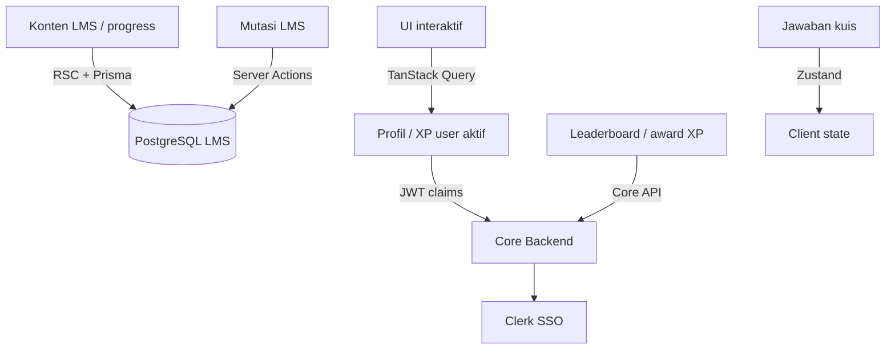

# 🏛️ JepangKu LMS - System Architecture Guide

Dokumen ini menjelaskan desain sistem, pola arsitektur, dan struktur folder fisik dari **JepangKu LMS** (Fase 1 MVP). Struktur ini dirancang untuk skalabilitas, isolasi fitur, serta kolaborasi tim yang efisien.

> **Ekosistem multi-app:** Baca [ECOSYSTEM.md](./ECOSYSTEM.md) — Core Backend, Portal Berita, batas DB LMS, User jangkar, Clerk di Core.  
> **UI & visual:** [DESIGN.md](../DESIGN.md)

---

## 🧭 Desain Arsitektur: Feature-Based (Domain-Driven)

JepangKu LMS mengadopsi pola **Feature-Based (Domain-Driven)**. Folder `app/` murni bertindak sebagai routing layer ("resepsionis" aplikasi), sedangkan seluruh logika bisnis, state management, dan UI khusus diisolasi penuh di dalam folder `features/` berdasarkan domain bisnisnya.

### Mengapa Pendekatan Ini?
- **Isolasi Domain:** Developer yang mengerjakan `quiz-engine` tidak akan mengganggu file di domain `gamification` atau `learning`.
- **Maintainability:** Komponen UI, Server Actions, dan store yang khusus untuk satu fitur dikelompokkan bersama, mempermudah pelacakan kode.
- **Sterilisasi Routing:** Halaman di folder `app/` sangat tipis, hanya bertugas menerima params, memanggil layout global, dan mengimpor wrapper component dari folder `features/`.

---

## 📁 Struktur Folder Utama

```plaintext
jepangkuLMS/
├── app/                           # 🌐 LAYOUT & ROUTING (Thin Layer)
│   ├── (authentication)/          # Route Group Auth (Sign-in / Sign-up)
│   │   ├── sign-in/[[...sign-in]] # Form Login Custom via Clerk
│   │   └── sign-up/[[...sign-up]] # Form Register Custom via Clerk
│   │
│   ├── (marketing)/               # Route Group Publik (/, /kursus, /tentang, …)
│   │   ├── layout.tsx
│   │   ├── page.tsx               # Landing Page
│   │   ├── kursus/                # Katalog & detail kursus publik
│   │   ├── tryout/                # Info tryout JLPT
│   │   ├── tentang/               # Tentang JepangKu
│   │   ├── cara-belajar/          # Panduan belajar
│   │   ├── hubungi/               # Kontak admin
│   │   ├── syarat-ketentuan/
│   │   └── kebijakan-privasi/
│   │
│   ├── (student)/                 # Route Group Siswa — URL tetap /dashboard/*
│   │   ├── layout.tsx             # Student shell + Core hydrate
│   │   └── dashboard/
│   │       ├── belajar/[courseSlug]/[lessonSlug]
│   │       ├── kuis/[lessonSlug]/hasil
│   │       ├── kursus/
│   │       ├── leaderboard/
│   │       ├── profil/
│   │       ├── achievements/
│   │       └── tryout/
│   │
│   ├── (admin)/                   # Route Group Admin — URL tetap /admin/*
│   │   ├── layout.tsx
│   │   └── admin/
│   │       ├── dashboard/         # Statistik ringkasan
│   │       ├── pembayaran/        # Validasi enrollment manual
│   │       ├── kursus/            # CMS kursus
│   │       ├── lesson/            # CMS lesson
│   │       └── quiz/              # CMS soal & import
│   │
│   ├── api/                       # Route handlers (auth, webhooks, …)
│   ├── layout.tsx                 # Root Layout Utama
│   └── globals.css
│
├── components/                    # 🏗️ SHARED GLOBAL COMPONENTS
│   ├── layout/                    # Sidebar Navigasi Utama, Navbar Dashboard
│   ├── providers/                 # QueryProvider; sesi dari JWT claims Core
│   └── ui/                        # Komponen Primitif Shadcn UI (Button, Card, dll.)
│
├── features/                      # 🧠 DOMAIN LOGIC (Isolasi Fitur)
│   ├── gamification/              # Logika XP, Level, Badge, & Peringkat
│   ├── learning/                  # Manajemen Modul, Lesson, & Video Player
│   ├── quiz-engine/               # State, Layout, & Evaluasi Kuis
│   └── admin-cms/                 # CMS Internal Admin & Validasi Pembayaran
│
├── hooks/                         # ⚓ Custom Hooks Global (useMediaQuery, dll.)
├── lib/                           # ⚙️ prisma.ts, validations, query-client
│   └── core/                      # 🔗 Abstraksi Core Backend (profil, gamifikasi)
└── prisma/                        # 🗄️ Schema DB LMS saja (User = jangkar FK)
```

---

## 🔑 Detail Domain Fitur (`features/`)

Setiap sub-folder di dalam `features/` memiliki batas tanggung jawab yang jelas:

### 1. `features/gamification`
- **Tanggung Jawab:** UI leaderboard, XP bar, badge gallery — **data dari JepangKu Core** via `lib/core/`, bukan tabel XP di PostgreSQL LMS.
- **Server Actions / fetch:** User aktif dari **JWT claims**; leaderboard & award XP via Core API — semua lewat `lib/core/`.
- **Komponen (`components/`):**
  - `LeaderboardTable.tsx`, `LevelProgressBar.tsx` — terima props / query dari Core.

### 2. `features/learning`
- **Tanggung Jawab:** Menyediakan konten materi pembelajaran, video streaming, silabus, dan mencatat progres belajar siswa.
- **Server Actions (`actions/`):**
  - `completeLesson()`: Menandai lesson selesai di DB LMS; event XP ke Core (kontrak TBD).
  - `getCourseContent()`: Mengambil daftar materi dari DB.
- **Komponen (`components/`):**
  - `VideoPlayer.tsx`: Secured video player embed untuk materi video.
  - `SilabusAccordion.tsx`: Navigasi daftar modul dan lesson di workspace belajar.

### 3. `features/quiz-engine`
- **Tanggung Jawab:** Mengelola rendering soal kuis, navigasi antar-pertanyaan, validasi jawaban siswa, dan penyimpanan state kuis sementara.
- **State Management (`store/`):**
  - `useQuizStore.ts` (Zustand): Menyimpan state jawaban sementara user agar reaktif dan tidak memicu re-render seluruh halaman.
- **Server Actions (`actions/`):**
  - `submitQuizAttempt()`: Mengirim jawaban akhir ke server untuk divalidasi dan dihitung skornya.

### 4. `features/admin-cms`
- **Tanggung Jawab:** Dashboard khusus admin untuk manajemen materi pelajaran, import bulk bank soal via Excel/CSV, serta validasi manual bukti transfer pembayaran kelas.
- **Server Actions (`actions/`):**
  - `approvePayment()`: Mengubah status pembayaran dan men-enroll siswa ke kelas terkait.
  - `uploadExcelMateri()`: Membaca file CSV/Excel dan menyimpannya ke database (Prisma).

---

## 📊 Aliran Data & Aturan State Management

Aplikasi ini membagi penanganan data menjadi tiga kategori utama untuk menjaga performa:



1. **Data LMS (kursus, kuis, progress):** Prisma + RSC / Server Actions ke DB lokal.
2. **Profil & gamifikasi (sesi sendiri):** Parse **JWT claims** via `lib/core/session.ts` — jangan query nama/XP dari `User` Prisma.
3. **User jangkar:** Pastikan baris `User { id }` ada sebelum FK (`Enrollment`, `QuizAttempt`, …); `id` = Core/Clerk user id.
4. **TanStack Query:** Cache data Core (leaderboard, profil).
5. **Zustand:** State kuis sementara di `features/quiz-engine/store/`.

---

## 🔐 Keamanan & identitas

- **SSO:** Clerk pada **Core Backend**; Core menerbitkan **JWT + claims** (profil, XP, roles). LMS memverifikasi token lalu `buildSessionFromVerifiedJwt()`.
- **Proxy:** Proteksi `app/(student)/dashboard/*` dan `app/(admin)/admin/*` setelah mekanisme sesi jelas.
- **Admin LMS:** Role/permission dari Core — jangan simpan `Role` enum di DB LMS.
- **Webhook Clerk di LMS:** Jangan menganggap sebagai arsitektur final; target sync & profil di Core. LMS hanya perlu **upsert `User` jangkar** bila diperlukan untuk FK.

---

## ✅ Testing & Quality Gate

- **Unit/logic layer:** gunakan `bun test` untuk fungsi deterministic di `lib/**` dan logic domain di `features/**`.
- **UI/browser layer:** gunakan Playwright (`@playwright/test`) untuk E2E lintas route dan regresi UI.
- **Aturan praktis:** setiap perubahan fitur yang menyentuh alur user wajib punya minimal satu test regresi (unit atau E2E sesuai konteks perubahan).
- **Referensi implementasi & scope lengkap:** [TESTING.md](./TESTING.md).
