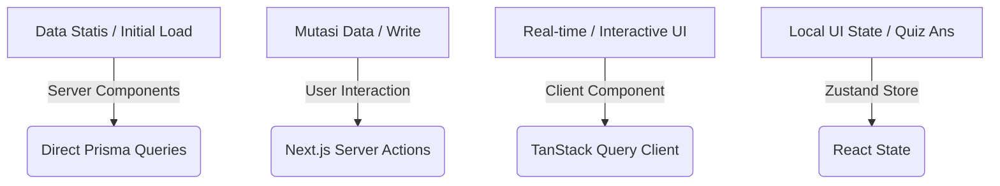

# 🏛️ JepangKu LMS - System Architecture Guide

Dokumen ini menjelaskan desain sistem, pola arsitektur, dan struktur folder fisik dari JepangKu LMS (Fase 1 MVP). Struktur ini dirancang untuk skalabilitas, isolasi fitur, serta kolaborasi tim yang efisien.

---

## 🧭 Desain Arsitektur: Feature-Based (Domain-Driven)

JepangKu LMS mengadopsi pola **Feature-Based (Domain-Driven)**. Folder `app/` murni bertindak sebagai routing layer ("resepsionis" aplikasi), sedangkan seluruh logika bisnis, state management, dan UI khusus diisolasi penuh di dalam folder `features/` berdasarkan domain bisnisnya.

### Mengapa Pendekatan Ini?
- **Isolasi Domain:** Developer yang mengerjakan `quiz-engine` tidak akan mengganggu file di domain `gamification` atau `learning`.
- **Maintainability:** Komponen UI, Server Actions, dan store yang khusus untuk satu fitur dikelompokkan bersama, mempermudah pelacakan kode.
- **Sterilisasi Routing:** Halaman di folder `app/` sangat tipis, hanya bertugas menerima params, memanggil layout global, dan mengimpor wrapper component dari folder `features/`.

---

## 📁 Struktur Folder Utama

```plaintext
jepangkuLMS/
├── app/                           # 🌐 LAYOUT & ROUTING (Thin Layer)
│   ├── (authentication)/          # Route Group Auth (Sign-in / Sign-up)
│   │   ├── sign-in/[[...sign-in]] # Form Login Custom via Clerk
│   │   └── sign-up/[[...sign-up]] # Form Register Custom via Clerk
│   │
│   ├── (dashboard)/               # Route Group Dashboard (Protected)
│   │   ├── dashboard/             # Student Hub Utama
│   │   ├── belajar/               # Course & Lesson Workspace
│   │   │   └── [courseSlug]/[lessonSlug]
│   │   ├── kuis/                  # Workspace Kuis (Focus Mode)
│   │   │   └── [lessonSlug]/      # Kuis & Hasil Evaluasi
│   │   ├── leaderboard/           # Papan Peringkat Global
│   │   └── gamifikasi/            # Progress & Profil Pencapaian
│   │       └── profil-saya/
│   │
│   ├── admin/                     # Area Khusus Admin (Protected)
│   │   ├── dashboard/             # Statistik Ringkasan Admin
│   │   ├── pembayaran/            # Verifikasi Akses & Pembayaran
│   │   ├── kursus/                # CMS Kursus & Form
│   │   ├── lesson/                # CMS Lesson & Form
│   │   └── quiz/                  # CMS Soal Kuis & Bulk Import CSV
│   │
│   ├── kursus/                    # Halaman Publik Katalog Kursus
│   ├── tryout/                    # Halaman Publik Info Tryout
│   ├── tentang/                   # Halaman Statis Tentang
│   ├── cara-belajar/              # Halaman Statis Cara Belajar
│   ├── hubungi/                   # Halaman Statis Hubungi Kami
│   │
│   ├── api/webhooks/clerk/        # Webhook Sinkronisasi User Clerk
│   ├── layout.tsx                 # Root Layout Utama
│   └── page.tsx                   # Public Landing Page
│
├── components/                    # 🏗️ SHARED GLOBAL COMPONENTS
│   ├── layout/                    # Sidebar Navigasi Utama, Navbar Dashboard
│   ├── providers/                 # ClerkProvider, QueryProvider (TanStack)
│   └── ui/                        # Komponen Primitif Shadcn UI (Button, Card, dll.)
│
├── features/                      # 🧠 DOMAIN LOGIC (Isolasi Fitur)
│   ├── gamification/              # Logika XP, Level, Badge, & Peringkat
│   ├── learning/                  # Manajemen Modul, Lesson, & Video Player
│   ├── quiz-engine/               # State, Layout, & Evaluasi Kuis
│   └── admin-cms/                 # CMS Internal Admin & Validasi Pembayaran
│
├── hooks/                         # ⚓ Custom Hooks Global (useMediaQuery, dll.)
├── lib/                           # ⚙️ Shared Config (Prisma Client, Axios/Fetch)
└── prisma/                        # 🗄️ Prisma Database Schema & Seeds
```

---

## 🔑 Detail Domain Fitur (`features/`)

Setiap sub-folder di dalam `features/` memiliki batas tanggung jawab yang jelas:

### 1. `features/gamification`
- **Tanggung Jawab:** Mengelola XP, level siswa, badge pencapaian, dan leaderboard global.
- **Server Actions (`actions/`):**
  - `claimBadge()`: Memvalidasi dan menyimpan badge baru untuk user.
  - `getUserRank()`: Mengambil ranking user saat ini.
- **Komponen (`components/`):**
  - `LeaderboardTable.tsx`: Menampilkan top 10 siswa.
  - `LevelProgressBar.tsx`: Menampilkan XP & Level di dashboard utama.

### 2. `features/learning`
- **Tanggung Jawab:** Menyediakan konten materi pembelajaran, video streaming, silabus, dan mencatat progres belajar siswa.
- **Server Actions (`actions/`):**
  - `completeLesson()`: Menandai lesson sebagai selesai dan memicu XP bonus.
  - `getCourseContent()`: Mengambil daftar materi dari DB.
- **Komponen (`components/`):**
  - `VideoPlayer.tsx`: Secured video player embed untuk materi video.
  - `SilabusAccordion.tsx`: Navigasi daftar modul dan lesson di workspace belajar.

### 3. `features/quiz-engine`
- **Tanggung Jawab:** Mengelola rendering soal kuis, navigasi antar-pertanyaan, validasi jawaban siswa, dan penyimpanan state kuis sementara.
- **State Management (`store/`):**
  - `useQuizStore.ts` (Zustand): Menyimpan state jawaban sementara user agar reaktif dan tidak memicu re-render seluruh halaman.
- **Server Actions (`actions/`):**
  - `submitQuizAttempt()`: Mengirim jawaban akhir ke server untuk divalidasi dan dihitung skornya.

### 4. `features/admin-cms`
- **Tanggung Jawab:** Dashboard khusus admin untuk manajemen materi pelajaran, import bulk bank soal via Excel/CSV, serta validasi manual bukti transfer pembayaran kelas.
- **Server Actions (`actions/`):**
  - `approvePayment()`: Mengubah status pembayaran dan men-enroll siswa ke kelas terkait.
  - `uploadExcelMateri()`: Membaca file CSV/Excel dan menyimpannya ke database (Prisma).

---

## 📊 Aliran Data & Aturan State Management

Aplikasi ini membagi penanganan data menjadi tiga kategori utama untuk menjaga performa:



1. **Data Statis / Read-Heavy:** Menggunakan **React Server Components (RSC)** dengan memanggil Prisma client secara langsung (async/await) untuk rendering di sisi server yang cepat.
2. **Mutasi Data (Write/Update):** Wajib menggunakan **Next.js Server Actions** di folder `actions/` masing-masing fitur.
3. **Data Interaktif / Auto-Refresh:** Menggunakan **TanStack Query** di sisi client untuk query reaktif tanpa loading halaman penuh.
4. **Local UI State:** State transient seperti jawaban kuis yang sedang berjalan dikelola menggunakan **Zustand store** lokal fitur.

---

## 🔐 Arsitektur Keamanan & Autentikasi

- **Autentikasi Utama:** Menggunakan **Clerk Auth** Cloud.
- **Proxy Proteksi:** Next.js Proxy memeriksa status autentikasi untuk folder `app/(dashboard)/*` dan otorisasi role `ADMIN` untuk path `/admin/*`.
- **Sinkronisasi User DB:** Dikelola melalui Clerk Webhooks. Setiap ada user baru terdaftar di Clerk, webhook `/api/webhooks/clerk` akan dipanggil secara aman untuk membuat records User terkait di database lokal menggunakan Prisma.
