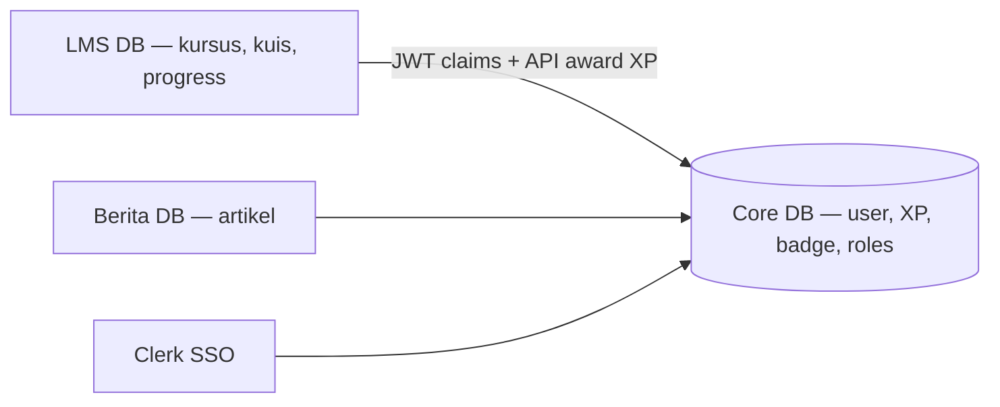
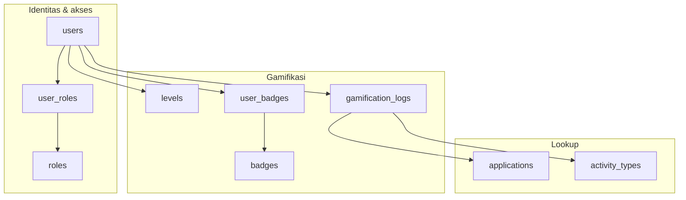

# 🗄️ JepangKu Core Backend — Konsep Arsitektur (Ringkas)

> ⚠️ **Bukan schema implementasi.** Untuk tabel, kolom, Prisma, DBML, seed, dan aturan bisnis → gunakan **[backend_core_services/](./backend_core_services/)** (`README.md` + `backend-core-services.prisma`).

Dokumen ini menjawab **mengapa** ada database Core terpisah dan **bagaimana** LMS/Berita memakainya. Detail teknis ada di folder canonical di atas.

**Lihat juga:** [ECOSYSTEM.md](./ECOSYSTEM.md) · Integrasi LMS: [lib/core/](../lib/core/)

---

## 1. Peran Core dalam ekosistem

| Masuk **Core DB** | Tetap di **app masing-masing** |
| :--- | :--- |
| Profil global (nama, email, avatar) | Kursus, lesson, soal, enrollment → LMS |
| XP, poin, level, badge, roles | Artikel, komentar → Berita |
| Audit perolehan XP (ledger + idempotency) | `QuizAttempt`, `UserProgress` → LMS |

**Kunci integrasi LMS:** `users.id` (Core) = `User.id` (LMS) = Clerk User ID (string).

---

## 2. Domain logikal (tanpa detail kolom)

| Domain | Inti desain |
| :--- | :--- |
| **Identitas** | Satu user Clerk = satu baris `users` |
| **Akses** | Role dipisah (`roles` + `user_roles`) untuk JWT & admin |
| **Level** | Master `levels`; stats user di-cache untuk performa |
| **Badge** | Master `badges` + junction `user_badges` |
| **Ledger** | Setiap award XP tercatat; **idempotency_key** wajib dari LMS |

Implementasi aktual (termasuk `current_points`, nama tabel pasti): **[backend_core_services/README.md](./backend_core_services/README.md)**.

---

## 3. Cara LMS mengonsumsi Core (disepakati)

| Kebutuhan | Mekanisme |
| :--- | :--- |
| Profil + XP + level + roles **user login** | **JWT claims** (snapshot dari DB Core) |
| Leaderboard (user lain) | **Core API** |
| Award XP setelah kuis/lesson | **Core API** + `idempotency_key` |
| FK di DB LMS | Hanya `User { id }` jangkar — bukan duplikasi profil |

Kode LMS: `lib/core/jwt-claims.ts`, `lib/core/session.ts`. Contoh payload JWT: [ECOSYSTEM.md](./ECOSYSTEM.md).

---

## 4. Migrasi dari desain draft awal

Dokumen ini awalnya menggambarkan variasi **3NF “ideal”** (`user_stats` terpisah, `xp_transactions`). Schema **final** yang dipakai tim disederhanakan dan didokumentasikan di `backend_core_services/`.

| Konsep draft (di sini dulu) | Implementasi final |
| :--- | :--- |
| `user_stats` tabel terpisah | Kolom `total_xp`, `current_points`, `current_level` di `users` |
| `xp_transactions` | `gamification_logs` + FK `applications`, `activity_types` |
| Tanpa poin spendable | `current_points` |

Jangan implement dari diagram lama di repo; selalu buka Prisma canonical.

---

## 5. Checklist singkat untuk tim

- [ ] Baca [backend_core_services/README.md](./backend_core_services/README.md) sebelum coding DB Core
- [ ] `users.id` = Clerk ID = LMS `User.id`
- [ ] JWT claims + idempotency XP diselaraskan dengan Sultan
- [ ] LMS tidak menyimpan email/XP/badge di Prisma lokal

---

## 6. Versi

| Versi | Tanggal | Catatan |
| :--- | :--- | :--- |
| 1.0–1.1 | 2026-06-03 | Draft panjang + JWT (arsip konsep) |
| 2.0 | 2026-06-03 | Dipendekkan; schema canonical pindah ke `backend_core_services/` |
