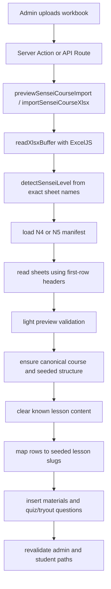
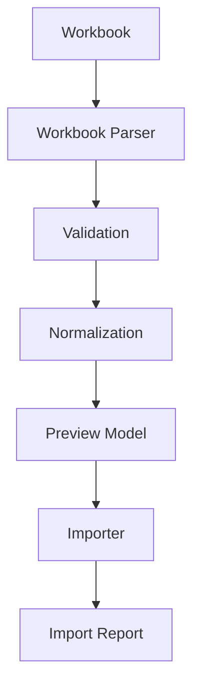
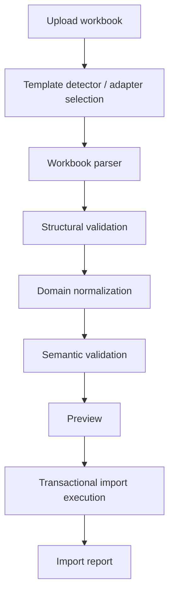
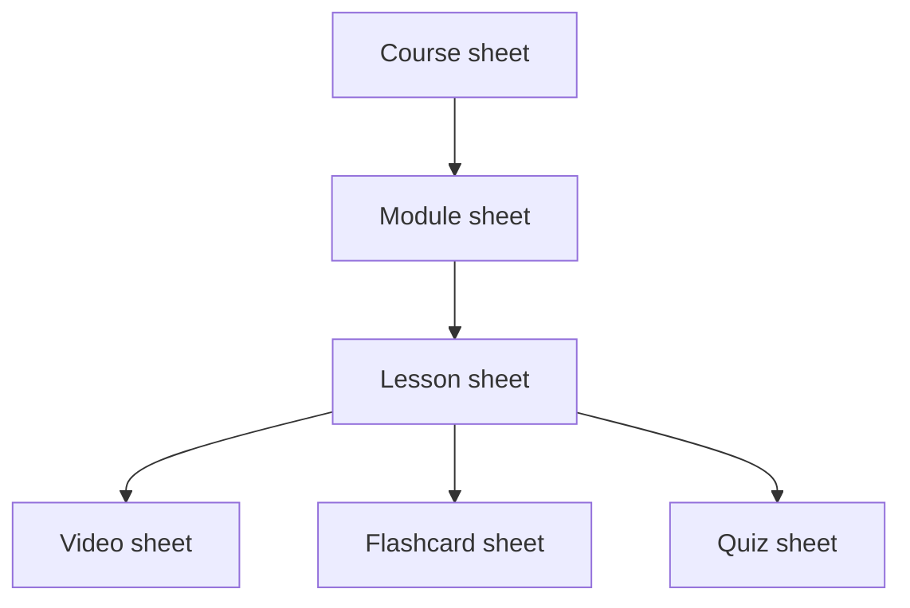

# Course Import Architecture Review

## Goal

Review the current Course Import implementation, identify its strengths and structural limitations, compare redesign options, and recommend a scalable future architecture before refactoring code.

This document is intentionally focused on architecture and workflow design. It does **not** authorize production refactoring yet.

## Executive Summary

The current Course Import feature is not a generic LMS content importer. It is a **curriculum-specific synchronization job** for pre-modeled JLPT N4/N5 courses.

That design was acceptable for the soft-launch phase because it allowed academic content from the teacher workbook to be mapped into a seeded LMS structure quickly. However, it is tightly coupled to:

- exact workbook sheet names
- exact workbook column headers
- hardcoded N4/N5 curriculum categories
- hardcoded lesson slugs
- pre-seeded course/module/lesson structures

The biggest architectural risk is not only coupling, but the combination of:

- destructive persistence
- permissive validation
- silent row skipping
- no import-wide transaction

That combination makes the current importer fragile for long-term academic authoring and risky as the content catalog expands.

For **V1**, the redesign should stay intentionally narrow:

- Parser
- Validator
- Normalizer
- Transactional Persistence
- Adapter
- Preview/Report

Future capabilities such as import jobs, import history, multiple import modes, import registries, and asynchronous execution should be postponed until there is a real product need.

## Scope Of Review

Reviewed areas:

- admin import UI and actions
- import entry points via server actions and API
- workbook parsing helpers
- sensei manifest layer
- curriculum/category mapping
- structure seeding
- persistence flow
- preview behavior
- validation behavior
- result reporting
- current tests

## Files Reviewed

### Entry points

- `app/(admin)/admin/kursus/import/page.tsx`
- `features/admin-cms/components/admin-course-import-page.tsx`
- `features/admin-cms/actions/cms-import-actions.ts`
- `app/api/admin/kursus/import/route.ts`

### Import core

- `features/admin-cms/lib/import-sensei-course-xlsx.ts`
- `features/admin-cms/lib/course-import-types.ts`
- `features/admin-cms/lib/xlsx-workbook.ts`

### Workbook manifests and curriculum coupling

- `prisma/lib/sensei-import-manifests/n4-manifest.ts`
- `prisma/lib/sensei-import-manifests/n5-manifest.ts`
- `prisma/lib/sensei-import-manifests/index.ts`
- `prisma/lib/sensei-import-manifests/types.ts`
- `prisma/lib/n4-curriculum.ts`
- `prisma/lib/n5-curriculum.ts`
- `prisma/lib/seed-n4-structure.ts`
- `prisma/lib/seed-n5-structure.ts`

### Adjacent/legacy references

- `app/api/admin/kursus/template/route.ts`
- `prisma/lib/import-syllabus-tree.ts`

### Tests

- `tests/unit/sensei-course-import.test.ts`
- `tests/helpers/build-sensei-test-workbook.ts`
- `tests/helpers/mock-sensei-import-prisma.ts`

## Current Architecture

### High-level flow



### Current import responsibilities

The current importer does all of the following inside one import service:

1. workbook detection
2. workbook parsing
3. structural validation
4. count/preview generation
5. course upsert
6. module/lesson structure seeding
7. destructive reset of lesson content
8. category creation
9. row-to-lesson routing
10. data insertion

This means parsing, validation, normalization, and persistence are tightly intertwined.

## Current Import Flow

### 1. Admin upload

The UI in `admin-course-import-page.tsx`:

- only accepts `.xlsx`
- converts the file to base64 in the browser
- calls either preview or import server action
- still presents itself as a “workbook sensei N4/N5” workflow

### 2. Preview

`previewSenseiCourseAction()`:

- requires admin access
- decodes base64 into a buffer
- calls `previewSenseiCourseImport()`

`parseWorkbook()` then:

- rejects files larger than `10 MB`
- reads workbook via `ExcelJS`
- detects level from exact sheet names
- loads the N4 or N5 manifest
- reads a fixed set of sheets using `sheetFirstRowToRecords()`
- validates only a small set of structural constraints
- computes summary counts and warnings

### 3. Import

`importSenseiCourseAction()`:

- requires admin access
- calls `importSenseiCourseXlsx()`

`importSenseiCourseXlsx()` then:

- re-runs workbook parsing
- upserts the single canonical course for the detected level
- seeds the fixed N4/N5 LMS course structure
- clears materials/questions from every seeded lesson
- maps rows into seeded lesson slugs
- inserts flashcards and questions row by row
- returns a summary

## Workbook Assumptions In The Current System

The current importer assumes:

- exact sheet names such as `N5 - 漢字 (Kanji)` and `N5 - Quiz 1`
- first row is the real header row
- exact header labels such as `Pertanyaan`, `Pilihan Jawaban`, `Jawaban Benar`
- workbook level can be inferred from tab naming
- workbook belongs to one of two known JLPT levels
- workbook does not define course/module/lesson structure directly
- workbook rows are routed through pre-existing curriculum category maps

This means the workbook is treated as a **data source for seeded lessons**, not as a first-class curriculum definition.

### Concrete observations from the reference workbook

The provided workbook reference (`Materi LMS JepangKu - Nihongo.xlsx`) confirms that the current authoring flow is teacher-friendly but workbook-first:

- content is grouped by subject track:
  - `N5 - 漢字 (Kanji)`
  - `N5 - 語彙 (Kosakata)`
  - `N5 - 文法 (Tata Bahasa)`
  - `N5 - Quiz 1`
  - `N5 - Quiz 2`
  - `N5 - Placement Test`
  - `N5 - Try Out 1`
- there are also non-import reference tabs such as:
  - `Kurikulum Live Class N5`
  - `Standar Kelulusan JLPT Versi CE`
  - `Link Soal JLPT`
- quiz rows encode answer options as one multiline cell, not one row per option
- placement and tryout sheets contain instructional rows above/between numbered questions
- category labels such as `Angka`, `Makanan`, and `Kopula & Predikat Dasar` function as curriculum routing hints rather than explicit lesson ownership

This reinforces the conclusion that the current workbook reflects a natural teacher authoring style, but not yet a stable LMS-domain import contract.

## Current Strengths

The current importer is not all wrong. It has several useful foundations:

- one shared import core is used by UI and API
- preview and import share parsing logic
- manifests already isolate some workbook naming concerns
- current tests cover basic N4/N5 preview/import behavior
- current design is predictable for the original launch workbook
- it already separates workbook helper utilities into `xlsx-workbook.ts`

Those strengths should be preserved in the redesign.

## Current Problems

### 1. Tight coupling to teacher workbook conventions

The importer is coupled to the original workbook shape instead of the LMS domain model.

Why this becomes a problem:

- every future workbook variation risks code changes
- the system becomes dependent on naming habits instead of stable content contracts
- academic staff cannot evolve templates safely without developer help

### 2. Tight coupling to seeded JLPT structure

Import does not create curriculum from workbook semantics. It imports into pre-seeded lesson slugs.

Why this becomes a problem:

- future courses cannot define their own module/lesson structure
- non-JLPT courses do not naturally fit the current category-to-slug routing approach
- adding new course shapes means changing code, manifests, and curriculum constants together

### 3. Validation is too light for a destructive importer

Preview checks readability, size, row count, and sheet presence, but many row-level issues are not surfaced as blocking validation.

Why this becomes a problem:

- malformed rows are silently skipped
- import output becomes hard to trust
- content owners cannot easily tell what was ignored vs imported

### 4. Parsing, normalization, and persistence are mixed

The importer directly parses workbook rows and immediately writes to Prisma using level-specific routing logic.

Why this becomes a problem:

- hard to unit test stages independently
- hard to preview normalized content before commit
- hard to introduce new lesson types without expanding import complexity

### 5. No import-wide transaction

The importer clears content first, then recreates data row by row without wrapping the whole operation in one DB transaction.

Why this becomes a problem:

- failures can leave a half-imported course
- destructive reset plus partial rebuild creates production risk
- retry behavior becomes operationally unsafe

### 6. Silent row skipping

Unknown categories, missing values, unmapped lesson slugs, and insufficient quiz options are often skipped using `continue`.

Why this becomes a problem:

- academic users receive incomplete imports without obvious feedback
- reconciliation becomes manual and error-prone
- trust in the importer declines over time

### 7. Extensibility is poor

The current importer has no general plug-in model for lesson content types.

Why this becomes a problem:

- future lesson types like `ASSIGNMENT`, `AUDIO`, `PDF`, or `WRITING` would require branching logic in the import core
- the importer will accumulate large condition trees

## Candidate Architectures

## Option A — Incremental Hardening of Current Importer

Keep the current sensei-specific importer, but improve validation, reporting, and transaction handling.

### Pros

- lowest implementation cost
- minimal disruption to current users
- quick safety improvements possible

### Cons

- still fundamentally workbook-specific
- still curriculum-specific
- still not a real import framework

### Scalability

Low. Suitable only if N4/N5 remain special-case imports.

### Maintenance cost

Moderate initially, high later as more workbook variants appear.

## Option B — Parser -> Validator -> Import Pipeline

Keep workbook import, but formally separate:

- parser
- validator
- normalized intermediate model
- importer

### Pros

- much safer and more testable
- allows preview from normalized data
- keeps code buildable incrementally
- easier to adopt without big-bang rewrite

### Cons

- still needs a domain contract and workbook contract
- if normalization is too workbook-specific, extensibility will still be limited

### Scalability

Good for medium-term evolution.

### Maintenance cost

Reasonable.

## Option C — Content Import Framework

Design the importer around the LMS domain, not around one workbook.



The key design principle:

- workbook format is only one input adapter
- normalized curriculum model becomes the central contract

### Pros

- future-proof
- suitable for many courses and many lesson types
- validation can be independent from persistence
- preview becomes natural
- workbook templates can evolve while import core stays stable

### Cons

- highest design and implementation cost
- requires strong contracts and migration planning
- more moving parts than current importer

### Scalability

High.

### Maintenance cost

Lower long-term, higher upfront.

## Option D — Multi-Template Adapter Architecture

Use a shared import pipeline, but allow multiple workbook adapters:

- `sensei-jlpt-v1`
- `official-course-v1`
- future `official-course-v2`

Each adapter outputs the same normalized curriculum contract.

### Pros

- preserves backward compatibility
- avoids hard migration cutoff
- good fit for gradual transition from teacher workbook to official template

### Cons

- requires template versioning discipline
- adapter sprawl can happen if not governed well

### Scalability

High if versioning stays controlled.

### Maintenance cost

Good long-term if older adapters are sunset deliberately.

## Recommended Architecture

The best fit for this LMS is:

**Option C with Option D compatibility strategy**

In practice:

- build a **Content Import Framework**
- define one **normalized domain import contract**
- support the current sensei workbook through a legacy adapter
- introduce one new official workbook template for long-term usage

For the current product stage, this should be implemented as a **simple V1 pipeline**, not as a full future platform on day one.

This provides the best balance between:

- backward compatibility
- maintainability
- future lesson-type extensibility
- academic-staff usability

## Recommended Future Workflow



### Stage responsibilities

### 1. Template detector / adapter selection

Responsibilities:

- identify workbook version or template family
- choose the proper parser adapter
- reject unsupported formats clearly

### 2. Workbook parser

Responsibilities:

- read sheets
- resolve aliases
- map raw cells into raw records
- stay persistence-agnostic

### 3. Structural validation

Responsibilities:

- required sheets exist
- headers are present
- required row structures are valid
- deterministic template rules are enforced

### 4. Domain normalization

Responsibilities:

- convert raw sheet rows into an LMS-aligned import graph:
  - course
  - modules
  - lessons
  - lesson content payloads
- attach stable identifiers and references

### 5. Semantic validation

Responsibilities:

- duplicate IDs
- invalid references
- invalid lesson ordering
- lesson type compatibility
- content missing for required lesson type
- unsupported values

### 6. Preview

Responsibilities:

- show normalized curriculum summary
- show warnings and errors
- allow staff to confirm before commit

### 7. Import execution

Responsibilities:

- translate normalized import model into Prisma writes
- own transaction strategy
- be free from workbook-specific assumptions

### 8. Import report

Responsibilities:

- human-readable results
- row/sheet issues
- summary counts
- warnings vs errors

## Proposed Normalized Domain Contract

The redesign should normalize workbook content into a structure like:

```ts
type NormalizedCourseImport = {
  template: {
    key: string;
    version: string;
    detectedBy: 'metadata' | 'sheet-pattern' | 'manual';
  };
  course: {
    externalId: string;
    title: string;
    slug?: string;
    level?: string | null;
    description?: string | null;
  };
  modules: Array<{
    externalId: string;
    title: string;
    order: number;
    lessons: Array<{
      externalId: string;
      title: string;
      order: number;
      lessonType: 'VIDEO' | 'FLASHCARD' | 'QUIZ' | 'TEXT';
      content: unknown;
    }>;
  }>;
};
```

The exact types can differ, but the principle should hold:

- parser outputs workbook data
- normalizer outputs LMS domain data
- importer only consumes normalized domain data

## Stable External Identifiers

The importer should never rely on display names or titles for identity.

### Recommendation

Every importable entity should have an immutable external identifier:

- `courseExternalId`
- `moduleExternalId`
- `lessonExternalId`

These IDs should come from the workbook template and survive title edits.

### Why immutable IDs matter

- titles naturally change during curriculum refinement
- translated or teacher-facing labels may vary
- synchronization cannot safely depend on mutable display strings
- upsert/update workflows require stable identity

### Identifier recommendations

### Course

- one stable course external ID per course workbook
- examples:
  - `jlpt-n5-main`
  - `nihongo-beginner-a1`

### Module

- one stable module external ID unique within the course
- examples:
  - `mod-intro-kana`
  - `mod-basic-grammar-01`

### Lesson

- one stable lesson external ID unique within the course
- examples:
  - `lsn-video-greetings`
  - `lsn-flashcard-numbers`
  - `lsn-quiz-module-01`

### Good rules

- external IDs should be author-visible but protected by template guidance
- external IDs should be ASCII-safe and immutable after publication
- slugs can still be derived or edited separately, but must not be the sync identity

### Contract recommendation

The normalized import model should treat external IDs as required for:

- official templates
- upsert-capable adapters

Legacy adapters may synthesize IDs during normalization if needed, but that should be considered compatibility behavior, not the long-term standard.

For V1, the external ID strategy should be defined clearly in the architecture, but the implementation can stay focused on the normalized contract and legacy adapter compatibility rather than building full synchronization modes immediately.

## Template Versioning

Template versioning should be explicit.

The importer should not rely solely on sheet names to infer compatibility.

### Recommendation

Every supported template should expose explicit metadata such as:

- `templateKey`
- `templateVersion`

For example:

- `sensei-jlpt`
- version `1`

or:

- `official-course`
- version `1`

### Where should metadata live?

Recommended order:

1. dedicated hidden metadata sheet
2. fallback metadata block in `README`
3. final fallback: sheet-pattern detection only for legacy adapters

### Why hidden metadata sheet is preferred

- deterministic for the importer
- avoids accidental teacher edits
- avoids polluting content sheets
- allows future metadata expansion cleanly

### Why README alone is not ideal

- teachers may rewrite instructional content
- parsing becomes more brittle

### Suggested metadata model

```ts
type TemplateMetadata = {
  templateKey: string;
  templateVersion: string;
  authoredFor?: 'JepangKu LMS';
};
```

### Detection strategy

- official templates:
  - detect by metadata sheet first
- legacy sensei templates:
  - detect by compatibility adapter logic (sheet patterns and expected manifests)

This avoids permanent dependence on sheet names while still supporting old files.

For V1, explicit version metadata is recommended for the new official template, while the legacy sensei adapter may continue using compatibility detection.

## Official Template Review

## Assessment of current workbook style

Based on the current implementation and manifests, the existing teacher workbook appears optimized for how a teacher naturally organizes material:

- separate subject tracks such as kanji, kosakata, tata bahasa
- separate quiz sheets
- level-specific tab naming
- multiline content inside cells for examples and explanations
- instructional/reference tabs mixed into the same workbook
- numbered content rows mixed with non-data guidance rows in placement/tryout sheets

What is good:

- subject grouping is natural for teachers
- spreadsheet authoring remains accessible
- row-based content entry is easy to understand
- rich examples can live in the same row without requiring multiple linked tables
- reference tabs can support the teacher's real workflow outside pure LMS import needs

What is not suitable as the long-term official template:

- no first-class module/lesson ownership in workbook
- no explicit lesson-level `lessonType` contract
- no generic structure for future lesson types
- sheet naming is too coupled to one curriculum family
- data tabs and non-import reference tabs are mixed together
- quiz options are encoded in one cell, which is convenient for drafting but brittle for deterministic validation
- sectional instructions inside question sheets make parser behavior depend on heuristic row filtering

## Teacher Authoring Experience

The workbook should not simply mirror the database schema.

It is an authoring tool for educators, not a raw data editor.

### Three template philosophies

### 1. Database-oriented template

Characteristics:

- mirrors tables directly
- one sheet per entity
- highly explicit references

Pros:

- easiest for developers to normalize
- deterministic and explicit

Cons:

- high cognitive load for teachers
- too much sheet switching
- feels like editing a database export

### 2. Domain-oriented template

Characteristics:

- mirrors LMS concepts like Course, Module, Lesson, Video, Flashcard, Quiz

Pros:

- aligns well with application architecture
- easier validation than teacher-first freeform structure

Cons:

- can still feel technical if too many IDs and relations are exposed directly

### 3. Teacher-oriented template

Characteristics:

- optimized around natural teaching workflow and material preparation
- may group related authoring tasks together

Pros:

- lowest cognitive load
- best adoption by academic staff

Cons:

- easiest to drift away from deterministic import rules if not carefully structured

### Recommendation

The best balance is:

**teacher-oriented authoring surface with domain-oriented normalization contract**

In practice:

- template should feel natural to teachers
- importer should normalize into strict LMS domain structures
- workbook should not expose unnecessary schema complexity

### Practical guidance

- keep `Course`, `Module`, and `Lesson` sheets explicit enough for stable references
- keep content sheets teacher-friendly and purpose-based
- reduce sheet switching where possible
- allow rich multiline examples where pedagogically useful
- avoid forcing teachers to think in low-level relational terms

### Example balance

- explicit IDs remain necessary
- but template copy, examples, and sheet layout should minimize cognitive burden
- content authors should mostly think in terms of:
  - course structure
  - lesson intent
  - materials/questions

not database linkage mechanics

For V1, the main requirement is to ensure the new official template is teacher-friendly enough to adopt, without trying to optimize every future authoring scenario up front.

## Recommended official template direction

Recommended sheet set for the official long-term template:

- `README`
- `Course`
- `Module`
- `Lesson`
- `Video`
- `Flashcard`
- `Quiz`
- optional future sheets:
  - `Audio`
  - `PDF`
  - `Assignment`
  - `LiveSession`

### Why this is better

- aligns with LMS domain model
- each lesson is explicit
- `lessonType` becomes authoritative
- content sheets can reference lesson IDs
- future lesson types become additive, not disruptive

However, this should not be interpreted as a literal database-sheet mirror. The official template should preserve teacher-friendly ergonomics even while staying deterministic for the importer.

## Recommended workbook structure



### Example high-level responsibilities

- `Course`: one course row, metadata
- `Module`: module IDs, titles, order
- `Lesson`: lesson IDs, module IDs, titles, order, `lessonType`
- `Video`: lesson-linked video data
- `Flashcard`: lesson-linked flashcard rows
- `Quiz`: lesson-linked question rows

### Authoring recommendation

The official template should include:

- example rows
- instructional notes
- clear separation between required and optional fields
- minimal cross-sheet hopping for common tasks

This keeps the workbook usable for teachers while still producing reliable normalization.

## Validation Strategy

Validation should be independent from persistence and split into two layers.

### Structural validation

- workbook readable
- required sheets exist
- allowed template version detected
- required headers exist
- no malformed row shapes

### Semantic validation

- duplicate module IDs
- duplicate lesson IDs
- duplicate row IDs where applicable
- invalid `moduleId` references
- invalid `lessonId` references
- invalid `lessonType`
- lesson content present only where compatible
- ordering fields valid
- required content not empty
- unsupported enum values rejected

Validation result should support:

- `errors`
- `warnings`
- row references
- sheet references

## Preview Strategy

A preview step is strongly recommended.

Recommended workflow:

```text
Upload -> Validate -> Normalize -> Preview -> Import -> Report
```

Why preview is worth it:

- reduces destructive mistakes
- gives staff confidence before commit
- allows warnings to be reviewed without guessing
- matches how spreadsheet-based bulk import tools should behave

## Transaction Strategy

Recommended approach:

- one normalized import object
- one persistence plan
- one top-level transaction **per course import**, where feasible

### Trade-offs

**One transaction**

- strongest consistency
- easy rollback
- safest for destructive replace operations

Downside:

- large imports can stress transaction duration

**Multiple transactions / batches**

- better for very large imports
- more flexible operationally

Downside:

- harder rollback semantics
- partial success becomes more likely

### Recommendation

For current LMS scope, prefer:

- **single transaction per course import**

If future imports become very large, the architecture can evolve later toward more advanced orchestration, but that is outside the V1 scope.

## Error Reporting Strategy

The current importer under-reports too many issues. The redesign should return a structured report.

Recommended model:

- **Error**: import cannot proceed
- **Warning**: import may proceed, but reviewer should know content will be altered/ignored

Report should support:

- human-readable messages
- sheet-level messages
- row-level messages
- field-level detail when useful
- summary counts

Recommended output shape:

```ts
type ImportIssue = {
  severity: 'error' | 'warning';
  sheet?: string;
  row?: number;
  field?: string;
  code: string;
  message: string;
};
```

### Partial success vs rollback

Recommendation:

- preview may contain warnings
- commit should fail on any validation errors
- destructive content import should prefer **complete rollback**, not partial success

## Extensibility Strategy

The importer should align with the new lesson architecture.

Recommended principle:

- the lesson type registry should remain the source of content-type capability rules
- the importer should not hardcode large lesson-type switches if avoidable

Practical direction:

- one registry for lesson-type validation rules
- one registry for lesson-type import normalizers
- one registry for lesson-type persistence adapters

This allows future types such as:

- `ASSIGNMENT`
- `AUDIO`
- `PDF`
- `SPEAKING_PRACTICE`
- `WRITING_EXERCISE`
- `LIVE_SESSION`

to be added with small, additive changes.

For V1, this should remain a **simple, local abstraction** inside the persistence/normalization layers if needed, not a formal import registry framework yet.

## Backward Compatibility Strategy

Backward compatibility should be explicit, not accidental.

Recommended policy:

- keep the current sensei workbook as `sensei-jlpt-v1`
- build the new official template as `official-course-v1`
- allow both during migration
- sunset the old adapter later when staff are fully transitioned

## Risks

- overdesigning before the real authoring workflow is validated with teachers
- building too much generic machinery before one official template is agreed
- importing structure and content in one leap without a stable normalized contract
- underestimating how much current curriculum mapping logic is encoded outside the workbook

## Migration Plan

### Stage 1

Document current importer and freeze behavior.

### Stage 2

Introduce normalized import model and validation pipeline in parallel.

### Stage 3

Build `sensei-jlpt-v1` adapter into the new pipeline for compatibility.

### Stage 4

Design and release `official-course-v1` workbook template.

### Stage 5

Add preview + structured issue reporting to the new pipeline.

### Stage 6

Switch admin UI to the new pipeline.

### Stage 7

Retire destructive silent-skip behavior and sunset old entry points as appropriate.

## Recommendation Summary

Do not keep evolving the current importer as if it were already generic.

Instead:

1. treat the current importer as a legacy adapter
2. define a normalized LMS import contract
3. implement parser -> validator -> normalizer -> preview -> transactional importer -> reporter stages
4. design a domain-driven but teacher-friendly official workbook template
5. keep compatibility through adapter versioning rather than hardcoded workbook assumptions

That path best fits the new lesson architecture and gives the LMS a maintainable import system for N4, N3, N2, N1, and non-JLPT courses.
