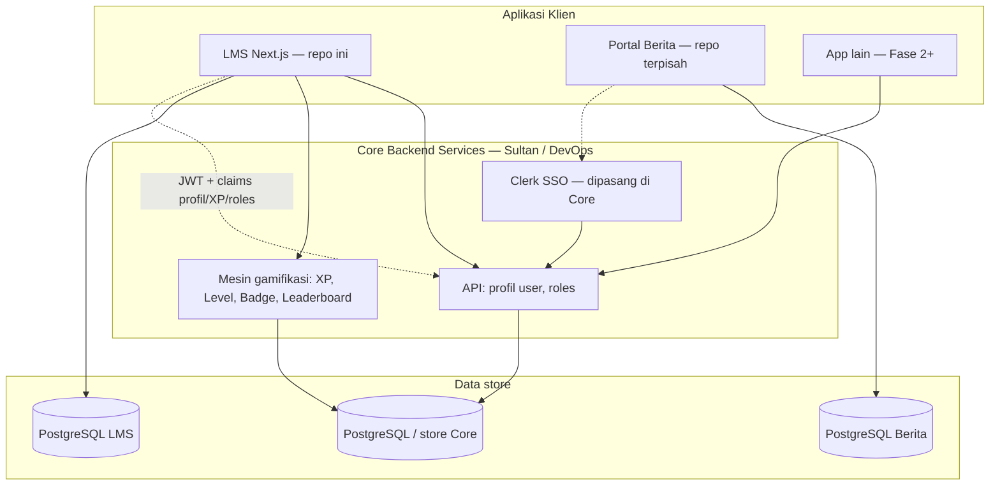

# 🌐 JepangKu Ecosystem — Arsitektur & Batas LMS

Dokumen ini adalah **pedoman arsitektur tingkat ekosistem** untuk semua Agent dan developer yang bekerja di repo **JepangKu LMS**. Baca ini sebelum mengasumsikan auth, profil user, atau gamifikasi “hidup” di database lokal.

**Repo ini:** hanya **LMS** (`kursus.jepangku.com`). Bukan Portal Berita, bukan Core Backend.

---

## 1. Visi ekosistem (Fase 1+)

JepangKu adalah **ekosistem multi-aplikasi** dengan layanan inti bersama. Fase 1 mencakup dua aplikasi publik; fase berikutnya dapat menambah Portal Kerja, LPK, dll.



| Layanan | Pemilik tim | Database | Scope utama |
| :--- | :--- | :--- | :--- |
| **Core Backend** | Sultan (DevOps/Partner) | Sendiri | SSO (Clerk), profil global user, gamifikasi (XP, poin, level, badge) |
| **Portal Berita** | Habibi (Partner) | Sendiri | Artikel, komentar, editorial |
| **LMS** | Kris (Anda) | **PostgreSQL LMS mandiri** | Kursus, lesson, materi, kuis, **progress belajar LMS** |

---

## 2. Batas tanggung jawab LMS (repo ini)

### Yang BOLEH / WAJIB di LMS

- Konten pembelajaran: `Course`, `Lesson`, materi (Kanji, Kosakata, Tata Bahasa).
- Bank soal & kuis: `Question`, `QuizAttempt` (skor, jawaban, progress per lesson).
- Enrollment & akses kelas di konteks LMS.
- Model **`User` jangkar** (`id` = user id dari Core / Clerk) untuk relasi FK Prisma native.
- UI leaderboard, XP bar, profil — **data dari Core**, bukan query XP di DB LMS.

### Yang TIDAK BOLEH di DB LMS

- Profil lengkap: email, nama, avatar (sumber: Core).
- XP, level, poin, badge global (sumber: Core).
- Artikel berita (Portal Berita).
- Konfigurasi Clerk secret / webhook utama (target: **Core Service**; LMS konsumen sesi).

### Keputusan integrasi (disepakati tim)

| Topik | Keputusan | Implikasi untuk kode LMS |
| :--- | :--- | :--- |
| **Data profil user aktif** | **JWT dari Core berisi claims** (bukan token kosong) | Parse lewat `lib/core/jwt-claims.ts` → `buildSessionFromVerifiedJwt()` |
| Isi claims (indikatif) | `sub`, `email`, `name`, `picture`, namespace `jepangku.*` (displayName, avatarUrl, totalXp, level, roles) | Selaraskan field final dengan Sultan — lihat [CORE_ERD.md](./CORE_ERD.md) § JWT |
| Validasi token | Core menerbitkan / memverifikasi JWT (Clerk → Core) | LMS verify signature lalu baca claims; **jangan** query Prisma untuk nama/XP sendiri |
| Leaderboard / data user lain | Bukan di JWT sesi | Tetap **Core API** (`getLeaderboard`) atau endpoint terpisah |
| Award XP setelah kuis/lesson | Event ke Core (API) | `xp_transactions` + `idempotency_key` — JWT untuk baca, API untuk tulis |
| Clerk webhook | Core (disepakati) | LMS tidak sync profil penuh; opsional upsert `User` jangkar saat login |

### Yang masih TBD (minor)

| Topik | Catatan |
| :--- | :--- |
| Nama pasti namespace claim (`jepangku` vs lain) | Dokumentasikan di OpenAPI Core saat siap |
| Cookie vs `Authorization: Bearer` | Layer `getCoreSession()` di `lib/core/session.ts` |

---

## 3. Model `User` jangkar (Prisma lokal)

```prisma
/// FK anchor — id = Clerk User ID / Core User ID (String). Bukan sumber profil.
model User {
  id        String   @id
  createdAt DateTime @default(now())

  enrollments Enrollment[]
  progress    UserProgress[]
  attempts    QuizAttempt[]
}
```

- **`id` tidak `@default(uuid())`** — nilai diset saat user pertama kali tercatat di LMS (biasanya dari sesi Core/Clerk).
- Relasi `UserProgress`, `QuizAttempt`, `Enrollment` tetap `@relation` ke `User` untuk integritas SQL.
- **Tidak** menambah `email`, `name`, `clerkId` terpisah, `UserStat`, `Badge`, dll. di schema LMS.

Migrasi dari schema lama (profil + gamifikasi lokal) didokumentasikan di changelog schema & `docs/PROGRESS.md`.

---

## 4. Layer abstraksi Core (`lib/core/`)

Agar perubahan mekanisme Core tidak merusak UI:

| File / folder | Peran |
| :--- | :--- |
| `lib/core/types.ts` | `CoreUserProfile`, `CoreGamificationSummary`, dll. |
| `lib/core/jwt-claims.ts` | Tipe & mapper `JepangKuJwtClaims` → profil/XP |
| `lib/core/session.ts` | `buildSessionFromVerifiedJwt()`, `getCoreSession()` |
| `lib/core/user-profile.ts` | `getUserProfileFromClaims()`, fallback sesi |
| `lib/core/client.ts` | HTTP client ke Core (leaderboard, award XP) |

**Aturan Agent:**

1. Komponen UI **tidak** import Prisma untuk nama/XP/level user.
2. Server Components memakai **`getCoreSession()`** atau `getUserProfileFromClaims(claims)` setelah verify JWT.
3. TanStack Query untuk **leaderboard** (data orang lain) — Core API, bukan claims JWT.

Contoh claims (indikatif — selaraskan dengan Sultan):

```json
{
  "sub": "user_2abc…",
  "email": "siswa@example.com",
  "name": "Kenji Tanaka",
  "picture": "https://…",
  "jepangku": {
    "displayName": "Kenji Tanaka",
    "avatarUrl": "https://…",
    "totalXp": 7850,
    "currentPoints": 1200,
    "level": 12,
    "roles": ["STUDENT"]
  }
}
```

---

## 5. Gamifikasi di UI LMS

Route sitemap (`/leaderboard`, `/gamifikasi/profil-saya`, XP di dashboard) **tetap ada** di LMS, tetapi:

- **Backend data** → Core Service.
- Folder `features/gamification/` → komponen + client Core + mapping ke UI [DESIGN.md](../DESIGN.md).
- Setelah kuis selesai, LMS menyimpan `QuizAttempt` lokal; **penambahan XP** ke user dilakukan via event/API ke Core (detail TBD), bukan `UserStat` lokal.

---

## 6. Autentikasi & Clerk

- **Clerk dipasang di Core Backend** (managed identity, SSO ekosistem).
- LMS menerima **JWT dari Core** (setelah login via ekosistem Clerk); data user aktif dibaca dari **claims**, bukan DB LMS.
- Env LMS: `JEPANGKU_CORE_JWT_*` untuk verify + `JEPANGKU_CORE_API_URL` untuk leaderboard/award XP (lihat `.env.example`).

---

## 7. Fase berikutnya (konteks skalabilitas)

Pendekatan ini mendukung penambahan app (Portal Kerja, LPK, …) yang:

- Memakai **SSO + profil + gamifikasi** yang sama dari Core.
- Memiliki **database domain sendiri** (seperti LMS & Berita).

LMS tidak menjadi “monolith data user” untuk seluruh ekosistem.

---

## 8. Dokumen terkait

| Dokumen | Isi |
| :--- | :--- |
| [AGENTS.md](../AGENTS.md) | Aturan coding Agent + ringkasan ekosistem |
| [backend_core_services/](./backend_core_services/) | **Schema canonical** (Prisma + DBML + README) — handoff Sultan |
| [CORE_ERD.md](./CORE_ERD.md) | Konsep ringkas Core DB (bukan schema detail) |
| [ARCHITECTURE.md](./ARCHITECTURE.md) | Arsitektur teknis LMS (folder, data flow) |
| [sitemap.md](../sitemap.md) | URL — scope LMS saja |
| [PROGRESS.md](./PROGRESS.md) | Status implementasi |
| [DATABASE.md](./DATABASE.md) | Strategi DB LMS (dev lokal, prod portable) |

| Versi | Tanggal | Perubahan |
| :--- | :--- | :--- |
| 1.0 | 2026-06-03 | Arsitektur ekosistem: Core + Berita + LMS; User jangkar; gamifikasi ke Core |
| 1.1 | 2026-06-03 | Keputusan: profil/gamifikasi user aktif via **JWT claims**; leaderboard/award via API |
