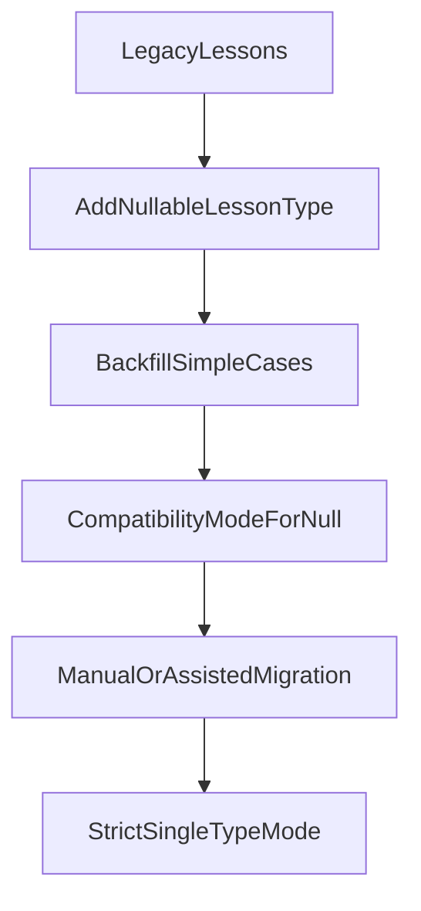

# Lesson Content Architecture Refactor

## Context

Current LMS hierarchy:

```text
Course
└── Module
    └── Lesson
```

Today, one `Lesson` can expose multiple content modes at once:

- `videoUrl` and `content` on the `Lesson` row
- flashcard materials via `MaterialKosakata`, `MaterialKanji`, `MaterialTataBahasa`
- quiz content via shared `Question` and `QuestionOption`

This made the admin workspace and student lesson page flexible, but also created:

- dynamic UI branching
- content-specific validation spread across multiple places
- weak invariants around what a lesson is supposed to represent
- difficult future expansion when more lesson types are introduced

The product direction is now clearer: **one lesson should represent one primary learning activity**.

## Current Architecture

### Data model

Current schema in [`prisma/schema.prisma`](../prisma/schema.prisma):

- `Lesson`
  - metadata: `id`, `moduleId`, `title`, `slug`, `order`
  - inline content fields: `content`, `videoUrl`
  - related content:
    - `kanjis`
    - `kosakatas`
    - `tataBahasas`
    - `questions`
  - student/engagement:
    - `progress`
    - `attempts`
    - `comments`

- Flashcards are not a single entity. Student flashcards are built by merging:
  - `MaterialKosakata`
  - `MaterialKanji`
  - `MaterialTataBahasa`

- Quiz content is shared with tryout:
  - `Question`
  - `QuestionOption`
  - `QuizAttempt`

### Runtime behavior

Admin:

- Lesson metadata is edited in [`features/admin-cms/components/admin-lesson-form.tsx`](../features/admin-cms/components/admin-lesson-form.tsx).
- Existing lesson content is edited in [`features/admin-cms/components/admin-lesson-workspace.tsx`](../features/admin-cms/components/admin-lesson-workspace.tsx).
- That workspace currently exposes tabs for:
  - `Informasi`
  - `Flashcard`
  - `Quiz`

Student:

- Lesson page entry: [`app/(student)/dashboard/belajar/[courseSlug]/[lessonSlug]/page.tsx`](../app/(student)/dashboard/belajar/[courseSlug]/[lessonSlug]/page.tsx)
- Main renderer: [`features/learning/components/lesson-workspace.tsx`](../features/learning/components/lesson-workspace.tsx)
- The student page dynamically builds tabs based on detected content:
  - video present
  - flashcards present
  - quiz present

### Important constraints

- Enrollment gating must remain intact.
- `Question` stays shared with tryout unless a major issue is found.
- `UserProgress`, XP, comments, and lesson video access all depend on lesson identity.
- Existing lesson data must be preserved.

## Problems With The Current Model

### Product ambiguity

The current model allows a lesson to mean many things simultaneously:

- an intro article
- a video lesson
- a flashcard session
- a quiz

That no longer matches product direction.

### Weak invariants

Today there is no strong domain rule that says:

```text
One Lesson -> One Primary Content Type
```

Instead, the system infers content shape by checking many related records.

### UI complexity

Both admin and student surfaces need dynamic tab logic and content detection:

- admin decides which editors to show
- student page decides which content tabs to render
- completion logic can become coupled to presence of multiple content modes

### Scaling risk

Future lesson types like `TEXT`, `AUDIO`, `PDF`, `ASSIGNMENT`, `EXTERNAL_RESOURCE`, or `SPEAKING_PRACTICE` will worsen branching unless the architecture becomes explicit.

## Architectural Options

### Option A: Simple `lessonType` discriminator on `Lesson`

Add nullable `lessonType` during migration:

```text
Lesson
- lessonType: VIDEO | FLASHCARD | QUIZ | TEXT | null
```

Keep current specialized content tables:

- `videoUrl` / `content` on `Lesson`
- flashcard materials in existing material tables
- quiz content in `Question`

Behavior:

- `lessonType` becomes the single source of truth once filled
- services/loaders validate that only the matching content is treated as primary
- legacy rows with `lessonType = null` use compatibility logic until migrated

Pros:

- lowest migration cost
- preserves current content tables
- avoids god tables
- easy to explain to product/admin users
- minimal disruption to tryout-sharing in `Question`

Cons:

- `Lesson` still knows too much about content families conceptually
- video/text stay inline on `Lesson`, while flashcard/quiz stay external
- without a renderer/editor registry, the app can still accumulate `switch` chains
- future reusable content is awkward if content later needs to be shared between lessons

### Option B: Composition model with dedicated content entities

Model:

```text
Lesson
- lessonType: nullable during migration

VideoLessonContent
- lessonId (1:1)
- videoUrl
- description/body

FlashcardLessonContent
- lessonId (1:1)

QuizLessonContent
- lessonId (1:1)

TextLessonContent
- lessonId (1:1)
- body
```

Specialized records remain owned by `Lesson`.

Pros:

- cleaner ownership boundaries
- removes content-specific fields from `Lesson`
- every type can evolve independently
- future lesson types add new content entities instead of widening `Lesson`
- better long-term separation for services, repositories, and editors

Cons:

- higher migration cost
- more tables and loader joins
- risk of introducing thin wrapper tables that only redirect to already-existing material/question relations
- may be more structure than needed right now, especially because flashcard and quiz content already live in dedicated tables

### Option C: Polymorphic `LessonContent` abstraction

Model:

```text
Lesson
- lessonContentId

LessonContent
- id
- type

VideoLessonContent
- lessonContentId

FlashcardLessonContent
- lessonContentId

QuizLessonContent
- lessonContentId
```

Pros:

- formally separates lesson shell from content implementation
- extensible in theory
- aligns with polymorphic thinking

Cons:

- Prisma and relational modeling become more complex
- indirection cost is high relative to current product needs
- migrations and application services become harder to reason about
- likely over-engineering for this codebase

### Option D: Hybrid model

Use `lessonType` now, but define code boundaries as if composition may happen later:

- keep existing schema mostly intact
- add nullable `lessonType`
- treat `Lesson` as orchestration root
- place content loading/rendering/editing behind typed registries
- isolate per-type rules in strategies

This creates a path to composition later without forcing a table explosion immediately.

Pros:

- pragmatic for current state
- strong domain direction without large migration cost
- future upgrade path remains open

Cons:

- requires discipline in service boundaries
- schema is not as pure as full composition

## Comparison: Discriminator vs Composition

### Scalability

- **Discriminator only** scales fine for a moderate set of lesson types if content-specific logic is isolated behind strategies/registries.
- **Composition** scales better if lesson types become substantially different or require distinct lifecycle rules, versioning, or ownership semantics.

### Maintainability

- **Discriminator only** is easier to maintain now because the team already works with the current tables.
- **Composition** is cleaner conceptually, but only if the team is ready to absorb migration complexity and extra repository/service layers.

### Extensibility

- **Discriminator only** can become messy if new types are implemented with ad-hoc conditionals.
- **Composition** is more structurally extensible, but only pays off when new lesson types have truly different storage and editing requirements.

### Migration complexity

- **Discriminator only** wins clearly.
- **Composition** needs more data movement, more mapping, and more transitional compatibility code.

### Fit for this project now

Because flashcards and quiz already live in dedicated tables, a full composition redesign would partially duplicate existing composition. The project can get most of the value by making `lessonType` explicit and enforcing ownership and rendering/editor contracts in code.

## Recommended Solution

Recommend **Option D: Hybrid model**:

1. Add **nullable** `lessonType` on `Lesson` during migration.
2. Do **not** add redundant booleans like `hasVideo`, `hasFlashcard`, or `hasQuiz`.
3. Keep existing specialized content storage:
   - `Lesson.videoUrl` / `Lesson.content`
   - material tables
   - `Question`
4. Move per-type loading, validation, rendering, and editing behind registries/strategies.
5. Treat `lessonType` as the single source of truth for all non-legacy lessons.

This gives:

- low migration risk
- clear product semantics
- simpler admin/student UI
- future-proofing in code architecture
- no unnecessary database over-engineering

## Ownership Boundaries

### Recommended ownership model

For now, lesson content should be treated as **single-owner**:

```text
Lesson owns exactly one primary content family
Content is not reusable across multiple lessons
```

This matches the current system:

- flashcard materials belong directly to one lesson
- lesson quiz questions belong directly to one lesson
- video/text are stored on lesson itself

### Why single-owner is the right boundary now

- simpler authoring model for admins
- simpler deletion/move semantics
- easier progress, XP, and discussion ownership
- avoids needing content library management, versioning, or reference tracking

### Reuse in the future

If product direction later requires reusable assets, that should be an explicit future architecture decision:

- reusable reading library
- shared assignment bank
- reusable downloadable resources

That would justify a stronger composition or asset-reference model later.

For this refactor, content should be considered **permanently owned by a single lesson**.

## Database Design

### Proposed schema direction

Add:

- `LessonType` enum
- `Lesson.lessonType: LessonType?`

Migration rule:

- keep it nullable
- no default yet
- legacy lessons remain `null` until classified

Do not add:

- `hasVideo`
- `hasFlashcard`
- `hasQuiz`

Those would be derived truth and would drift from the real domain model.

### Why not a god table

Avoid something like:

```text
Lesson
- lessonType
- videoUrl?
- articleBody?
- pdfUrl?
- audioUrl?
- externalUrl?
- assignmentConfig?
- ...
```

That would create a growing nullable-field anti-pattern and make validation harder over time.

## Renderer / Editor Architecture

To avoid a large `switch` or deep `if` chains as lesson types grow, introduce a **registry + strategy** approach in application code.

### Suggested pattern

```text
LessonTypeRegistry
├── VIDEO -> videoLessonStrategy
├── FLASHCARD -> flashcardLessonStrategy
├── QUIZ -> quizLessonStrategy
└── TEXT -> textLessonStrategy
```

Each strategy owns:

- data loader hook/function selection
- validation rules
- admin editor component
- student renderer component
- optional empty-state component

### Example responsibility split

```text
lessonTypeDefinition = {
  type,
  adminEditor,
  studentRenderer,
  loadWorkspaceData,
  validateBeforeSave,
  validateBeforeRender,
}
```

### Why this is preferable

- adding a new type becomes a registration exercise instead of editing many condition chains
- renderer/editor rules stay co-located
- easier testing per lesson type
- keeps `lesson-workspace.tsx` and admin workspace from turning into branching hubs

### Recommended implementation style

Prefer a **typed registry of strategy objects** over a factory that returns ad-hoc classes.

Reason:

- simpler in TypeScript/React codebases
- easier tree-shaking and static analysis
- more ergonomic for React component references

## Backend Changes

### Lesson domain rules

For non-legacy lessons:

- `lessonType` is authoritative
- only matching content editors/actions may operate
- loaders should only fetch the relevant content family

Introduce reusable guards/helpers such as:

- `assertLessonType`
- `isLegacyLesson`
- `getLessonTypeDefinition`

### Validation

Examples:

- `VIDEO`
  - allow `videoUrl`
  - allow intro/body markdown
  - block quiz mutations
  - block flashcard mutations

- `FLASHCARD`
  - allow flashcard material mutations
  - block quiz mutations
  - ignore `videoUrl`

- `QUIZ`
  - allow lesson question mutations
  - block flashcard mutations
  - ignore `videoUrl`

- `TEXT`
  - allow body markdown only
  - block flashcard and quiz mutations

### Question model

Keep current shared architecture:

- `Question`
- `QuestionOption`
- `QuizAttempt`

No split is recommended now because:

- lesson quiz and tryout already coexist correctly
- splitting would add migration and repository complexity
- current pain is lesson identity, not question identity

## Frontend Changes

### Admin UI

New flow:

```text
Create Lesson
-> Choose Lesson Type
-> Show only relevant editor/workspace
```

Admin behavior:

- lesson form shows `lessonType`
- admin workspace resolves editor via registry
- no more top-level multi-content authoring for new lessons
- legacy lessons may show warning state and compatibility editor path until migrated

### Student UI

Student lesson page should render one primary experience:

- `VIDEO` -> video player + intro/body
- `FLASHCARD` -> flashcard deck
- `QUIZ` -> quiz panel
- `TEXT` -> article view

No dynamic tabs are needed for migrated lessons.

Legacy lessons with `lessonType = null` can temporarily keep current tab logic.

## Migration Strategy

### Rule 1: preserve data

No destructive migration at the beginning.

### Rule 2: nullable first

`lessonType` remains nullable until the team finishes legacy migration.

### Rule 3: classify only safe cases automatically

Automatic backfill only for unambiguous lessons:

- video only -> `VIDEO`
- flashcard only -> `FLASHCARD`
- quiz only -> `QUIZ`
- text only -> `TEXT`

### Rule 4: mixed-content lessons require explicit handling

If a lesson has more than one content family:

- keep `lessonType = null`
- mark it as legacy
- expose it in admin report or warning state
- migrate manually or with assisted split tooling later

### Rollout phases



## Risks

- legacy mixed-content lessons may survive longer than expected
- renderer/editor registry must be enforced consistently or branching can leak back in
- inline `videoUrl` / `content` on `Lesson` is still less pure than full composition
- admin migration UX for splitting mixed lessons may become a follow-up project

## Dependencies And Non-Goals

### Must stay compatible with

- enrollment gating
- lesson progress
- XP and points
- comments/Q&A
- video access API
- shared tryout question system

### Out of scope

- enrollment refactor
- auth changes
- gamification redesign
- tryout redesign
- notifications/email/payment

## Summary

The best near-term architecture is:

- nullable `lessonType` during migration
- no redundant flags
- existing content tables preserved
- registry/strategy-based renderer and editor model
- single-owner lesson content boundary
- compatibility mode for legacy lessons until all mixed-content data is migrated

That gives the project a cleaner domain model now, without paying the full cost of a large composition redesign before it is truly necessary.
