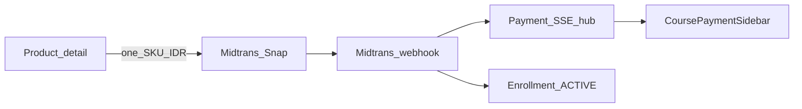
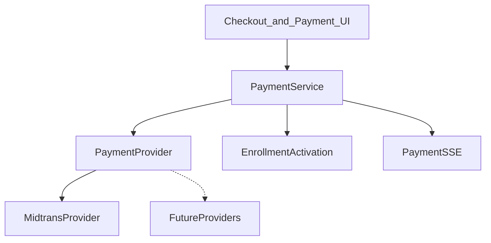

# Payment model — JepangKu LMS

**Status:** Locked (2026-07-30); Midtrans Course + SSE realtime (2026-07-31); engine shape refined (2026-07-31)  
**Scope:** Business rules + settle path + future-proof payment engine boundaries  
**Related:** Admin `/admin/pembayaran`; schema `Enrollment` / `Payment` / `EnrollmentLog`; code `lib/payment-engine/`, `lib/payment/sse-*`

---

## Decision (locked)

**Checkout = one product per payment.** No shopping cart for Midtrans Fase 1.

| Approach | JepangKu |
| :--- | :--- |
| Per-item (adopted) | Yes — one `Course` / `LiveClass` / `TryoutSession` → one Midtrans transaction → one `Enrollment` |
| Cart (multi-line) | Out of scope unless users routinely buy multiple SKUs in one session |
| Subscription | Different business model — not in current schema |

Bundles later (e.g. “Paket N5 + N4”) are a **single SKU** with one `priceIdr` that grants multiple enrollments — still one checkout, not a generic cart.

---

## Current state

```text
Course (priceIdr > 0, PAYMENT_PROVIDER=midtrans, PAYMENT_CHECKOUT_MODE=core — default)
  → /dashboard/checkout/kursus/[slug] → pilih metode → Pay Now
  → Midtrans Core API charge → Payment.instructions
  → /dashboard/pembayaran/[paymentId] + SSE
  → Webhook settle → Payment PAID + Enrollment ACTIVE

Legacy Snap (PAYMENT_CHECKOUT_MODE=snap)
  → requestCourseCheckout → snapToken → window.snap.pay
  → webhook + SSE sama

Course (manual) / Live Class / Tryout berbayar
  → Enrollment PENDING → bank + WA → admin approve → ACTIVE

priceIdr <= 0 → Enrollment ACTIVE immediately
```

- **Access source of truth:** `Enrollment.status`
- **Money source of truth:** `Payment.status`
- Engine: [`lib/payment-engine`](../lib/payment-engine/) (provider port + method registry)
- UI Course (Core): checkout + payment detail — no Snap popup

---

## Target flow (Midtrans Course — today Snap)

```text
Product detail → Bayar
  → create Enrollment PENDING + Payment (pending)
  → Midtrans Snap (order_id ↔ Payment)
  → Midtrans webhook settlement
  → Payment paid + Enrollment ACTIVE
  → SSE event → UI unlock
```



### Rules

1. Unit of sale: one polymorphic product (`COURSE` | `LIVE_CLASS` | `TRYOUT`).
2. Amount = that product’s `priceIdr` (IDR).
3. One Midtrans order unlocks exactly one enrollment (unless a future bundle SKU explicitly grants many).
4. Free products never call Midtrans.
5. Manual bank + WA may remain as temporary fallback; Live Class / Tryout still use it until Midtrans is wired for those types.

### Data layer

| Layer | Responsibility |
| :--- | :--- |
| `Enrollment` | Access (`PENDING` / `ACTIVE`) |
| `Payment` | Money: `orderId`, Midtrans fields, `status`, 1:1 with enrollment |

Do **not** introduce cart/line-item schema unless product revisits this ADR.

### Midtrans status → Prisma `PaymentStatus`

| Midtrans (`transaction_status` / fraud) | LMS `PaymentStatus` |
| :--- | :--- |
| `capture` / `settlement` (ok) | `PAID` |
| `pending` | `PENDING` |
| `challenge` / fraud challenge | `CHALLENGE` |
| `deny` | `DENIED` |
| `expire` | `EXPIRED` |
| `cancel` | `CANCELED` |
| other failure | `FAILED` |

SSE and admin UI use Prisma statuses — not raw Midtrans names.

**UI-only labels (not separate DB enums):** “waiting for method” = checkout before charge; “created” after charge still maps to `PENDING`.

---

## Payment engine architecture (shape)

Provider-agnostic orchestration. Phase 1 runtime still Midtrans-only; Xendit/Stripe are ports for later — **do not implement** until product asks.



| Layer | Responsibility |
| :--- | :--- |
| UI (`features/checkout`, `features/payment`) | Checkout + payment detail; no Midtrans SDK types |
| `PaymentService` (`lib/payment-engine`) | Build context → charge via provider → persist → SSE; apply webhook events → activate enrollment |
| `PaymentProvider` | `charge` / `cancel` / `fetchStatus` / `verifyWebhook` |
| `lib/payment/sse-*` | Realtime transport (unchanged contract) |

Code lives under [`lib/payment-engine/`](../lib/payment-engine/). Grow into this tree during Core checkout migration — no big-bang relocate of unrelated modules.

### Logical Payment Intent (no table)

**Do not add `PaymentIntent` / `CheckoutSession` tables** until vouchers, affiliates, or durable quotes need a reserved amount.

Today:

1. Compute in-memory **`CheckoutContext`** (product, buyer, pricing, provider).
2. On Pay Now → `PaymentService.charge(context, methodId)` → `Payment` row.

Later migration path: persist Intent between context and charge; `Payment.intentId` optional FK. Checkout UI keeps consuming the same context shape.

### CheckoutContext

Server-side DTO (see `lib/payment-engine/types.ts`). Phase 1 fills Course fields; `discountIdr` / `feesIdr` stay `0`; voucher/referral/campaign slots omitted until implemented.

Course actions may still accept `courseSlug` + `methodId` at the edge but **must** build `CheckoutContext` before calling the engine.

### Method registry (metadata)

UI must not hardcode method lists. Registry entries expose: `id`, `displayName`, `logoKey`, `category`, `enabled`, `maintenance`, `supportedPlatforms`, `priority`, `recommended`, `instructionKind`. Env can disable methods without UI changes.

### Normalized instructions

Persist provider-agnostic `PaymentInstructions` (`qris` | `va` | `ewallet` | `cstore`) for Payment Detail — desktop/mobile presentation adapters only; same DTO for live and history views.

### Payment Detail = history-ready

One page driven by loaded `Payment` + product summary + instructions:

- `PENDING` → SSE + cancel/change-method
- Terminal → read-only, same panels
- Future history list → links to the same route

---

## Payment realtime (SSE)

Stream key is **`Payment.id`** (`paymentId`), not Midtrans `transaction_id`.

| Item | Value |
| :--- | :--- |
| Endpoint | `GET /api/payments/[paymentId]/events` |
| Auth | Clerk session; owner = `enrollment.userId` |
| Transport | Native `EventSource` + `text/event-stream` |
| Fan-out | In-memory hub; Redis pub/sub when `REDIS_ENABLED=true` (`{REDIS_KEY_PREFIX}payment:{paymentId}`) |
| Snapshot | First `event: payment` is current DB row (late subscribers OK) |
| Heartbeat | SSE comment every ~15s |
| Publisher | Provider webhook adapter → Payment Service after successful DB write (publish failure must not fail HTTP 200) |

### Event payload (`event: payment`)

```ts
{
  paymentId: string
  orderId: string
  status: PaymentStatus // PENDING | CHALLENGE | PAID | DENIED | EXPIRED | CANCELED | FAILED
  enrollmentStatus: 'PENDING' | 'ACTIVE'
  enrollmentId: string
  productType: 'COURSE' | 'LIVE_CLASS' | 'TRYOUT'
  redirectPath: string | null // e.g. /dashboard/kursus/[slug] when PAID + ACTIVE
}
```

### Client (Course — Snap today)

1. `requestCourseCheckout` returns `snapToken` + `paymentId`.
2. Open Snap **and** subscribe `EventSource(/api/payments/{paymentId}/events)`.
3. On `PAID` + `ACTIVE`: toast → `router.refresh()` → `redirectPath` if set.
4. Snap callbacks remain **fallback** refresh only (no polling interval).
5. PENDING enrollments with an existing Payment row pass `paymentId` from the loader so “Lanjutkan Pembayaran” can subscribe without recreating checkout.

Hub/API are product-agnostic for Live Class / Tryout later; Course UI is the first consumer.

---

## Implementation checklist

1. ✅ Prisma `Payment` (+ statuses) linked to `Enrollment`
2. ✅ Midtrans server keys in env; Snap token from Course detail CTA
3. ✅ Webhook: verify signature → Status API → settle → `Enrollment ACTIVE`
4. ✅ Admin `/admin/pembayaran`: Midtrans rows not manually approve/reject
5. ✅ Idempotency via Midtrans `order_id` + Status API
6. ✅ SSE hub + `GET /api/payments/[paymentId]/events` + Course EventSource
7. ✅ Payment engine shape: `lib/payment-engine` types, provider port, method registry metadata
8. ✅ Midtrans Core API custom checkout UI (Course) — `/dashboard/checkout/kursus/[slug]` + `/dashboard/pembayaran/[paymentId]`
9. ⬜ Live Class / Tryout Midtrans checkout
10. ⬜ `EnrollmentLog` on Midtrans auto-settle (optional polish)

### Explicitly not Fase 1 / not this refinement

- Multi-item cart
- Complex voucher stacks / referral / campaigns (context slots only)
- `PaymentIntent` table
- Second PSP (Xendit/Stripe)
- Points/wallet as tender
- Subscription billing / gift purchase / refunds
- WebSocket / Pusher / Ably

---

## Future product fit (document only)

| Feature | Fit | Later seam |
| :--- | :---: | :--- |
| Course / Live / Tryout | Strong | `CheckoutContext.product.type` |
| Bundle / membership | Medium | Multi-enrollment activation on one Payment |
| Voucher / referral | Context-ready | Persist Intent before charge |
| Gift | Weak | Buyer ≠ beneficiary |
| Refund / subscription | Weak | New ADR |

---

## Why not cart

- Existing domain is already 1 user × 1 product enrollment.
- LMS buyers typically choose one course/session from a detail page.
- Midtrans refunds/disputes stay 1:1 with access.
- Cart adds order-line complexity without evidence of multi-buy demand.
