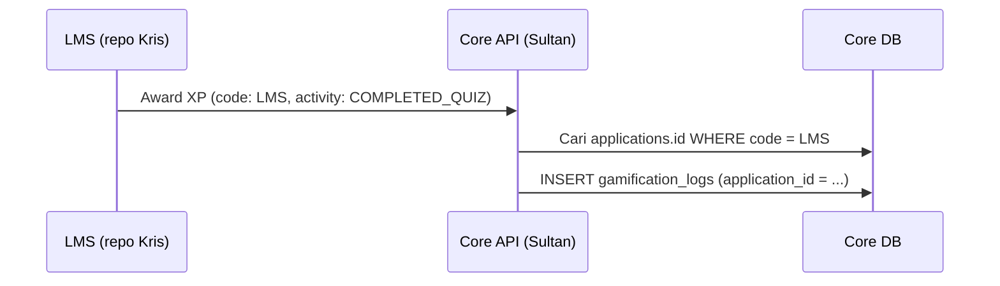

# 💡 Konsep Penting — `code`, Applications, & Activity Types

Dokumen ini menjawab pertanyaan umum saat pertama kali membaca schema Core. Untuk detail tiap kolom → [SCHEMA_REFERENCE.md](./SCHEMA_REFERENCE.md).

**Schema version:** `2.0.1`

---

## 1. Apa itu field `code`?

Di beberapa tabel ada kolom **`code`** (selain `id` dan `name`/`title`). Polanya **sama di semua tabel**:

| Kolom | Untuk apa | Contoh |
| :--- | :--- | :--- |
| **`id`** | Primary key di database — untuk **FK** & join SQL | `550e8400-e29b-41d4-a716-446655440000` atau `user_2abc…` (Clerk) |
| **`code`** | **Identifier tetap untuk manusia & program** — tidak berubah setelah deploy | `LMS`, `COMPLETED_QUIZ`, `STUDENT` |
| **`name` / `title`** | Label tampilan — **boleh** diubah (UI, terjemahan) | "JepangKu LMS", "Siswa" |

### Analogi sederhana

Bayangkan siswa di sekolah:

- **`id`** = nomor absen di database (bisa panjang, unik, tidak perlu diingat user).
- **`code`** = kode jurusan di sistem: `TKJ`, `RPL` — dipakai di API, log, dan kode aplikasi; **stabil**.
- **`name`** = "Teknik Komputer dan Jaringan" — bisa diganti labelnya tanpa merusak integrasi.

### Kenapa tidak cukup pakai `id` saja?

Client (LMS, Portal Berita) dan developer **lebih aman** memanggil:

```text
application: LMS
activity: COMPLETED_QUIZ
```

daripada mengingat UUID `a1b2c3d4-…` yang beda di staging vs production. UUID `id` tetap dipakai **di dalam Core** setelah resolve `code` → `id`.

### Kenapa tidak cukup pakai `name` saja?

`name` bisa berubah ("Portal Berita" → "JepangKu News"). Kalau log menyimpan nama string bebas, laporan dan API jadi tidak konsisten. **`code` = kontrak teknis** antar tim.

### Tabel yang punya field `code`

| Tabel | Contoh `code` | Dipakai untuk |
| :--- | :--- | :--- |
| `applications` | `LMS`, `PORTAL_BERITA` | Menandai **dari app mana** event XP berasal |
| `activity_types` | `COMPLETED_QUIZ`, `READ_ARTICLE` | Menandai **jenis perbuatan** user |
| `roles` | `STUDENT`, `LMS_ADMIN` | Masuk **JWT** `jepangku.roles`, cek akses |
| `badges` | `KUTU_BUKU`, `NIGHT_LEARNER` | Unlock badge di kode (tanpa hardcode UUID) |

**Aturan tim:** `code` huruf besar + underscore, **unique**, jangan di-rename sembarangan setelah production (treat seperti API breaking change).

---

## 2. Tabel `applications` — apa itu?

### Definisi satu kalimat

**Daftar aplikasi di ekosistem JepangKu** yang boleh memanggil Core untuk gamifikasi (dan mencatat asal event di ledger).

### Bukan ini

| Salah paham | Kenyataan |
| :--- | :--- |
| "Tabel aplikasi mobile di Play Store" | ❌ Bukan katalog APK |
| "Database LMS atau Berita" | ❌ Kursus/artikel tetap di DB masing-masing app |
| "Satu baris per user" | ❌ Satu baris per **produk** (LMS, Berita, LPK, …) |

### Isi tabel (konsep)

| Baris contoh | `code` | `name` |
| :--- | :--- | :--- |
| App belajar | `LMS` | JepangKu LMS |
| App berita | `PORTAL_BERITA` | Portal Berita |
| (Fase 2) | `LPK` | Portal LPK |

Setiap baris punya `id` (UUID) untuk foreign key di tabel lain.

### Kenapa perlu?

Ekosistem punya **banyak app**, **satu Core** untuk user & XP. Saat siswa dapat XP dari kuis **dan** dari baca artikel, Core harus tahu:

```text
XP +50 → dari aplikasi mana? (LMS vs Berita)
```

Itu disimpan di `gamification_logs.application_id` → join ke `applications`.

### Alur nyata



LMS **tidak** menyimpan baris di `applications` — hanya Core yang seed & maintain. LMS cukup kirim `code` yang disepakati (atau `applicationId` jika sudah di-resolve).

---

## 3. Tabel `activity_types` — “tipe aktivitas” apa?

### Definisi satu kalimat

**Katalog jenis perbuatan user** yang boleh menambah XP/poin — terpisah dari “aplikasi mana”.

### Beda dengan `applications`

| Pertanyaan | Jawaban di tabel |
| :--- | :--- |
| **Di app mana?** | `applications` (`LMS`, `PORTAL_BERITA`) |
| **User melakukan apa?** | `activity_types` (`COMPLETED_QUIZ`, `READ_ARTICLE`) |

Keduanya **wajib** di setiap baris `gamification_logs`:

```text
User X di aplikasi LMS menyelesaikan COMPLETED_QUIZ → +100 XP
User X di aplikasi PORTAL_BERITA melakukan READ_ARTICLE → +10 XP
```

### Contoh baris seed

| `code` | Arti bisnis |
| :--- | :--- |
| `COMPLETED_QUIZ` | Submit kuis di LMS (logic kuis ada di DB LMS) |
| `COMPLETED_LESSON` | Lesson ditandai selesai di LMS |
| `READ_ARTICLE` | Artikel dibaca di Portal Berita (artikel ada di DB Berita) |
| `DAILY_LOGIN` | Login harian (opsional, aturan Sultan) |
| `MANUAL_ADJUST` | Admin Core koreksi manual XP/poin |

### Kenapa tidak tulis string bebas di log?

Tanpa tabel lookup, developer bisa menulis:

```text
"quiz_done", "QUIZ", "completed_quiz", "kuis"
```

Laporan XP jadi kacau. **`activity_types` memaksa pilihan dari daftar resmi** (3NF lookup).

### Menambah tipe baru

Biasanya **hanya insert seed** + update dokumentasi API — **tanpa** migrasi schema:

```sql
INSERT INTO activity_types (id, code, description)
VALUES (gen_random_uuid(), 'PUBLISHED_ARTICLE', 'Editor mempublikasi artikel');
```

Tim Berita lalu memanggil API dengan `activity: PUBLISHED_ARTICLE` setelah disepakati.

---

## 4. Bagaimana `code` dipakai bersama di `gamification_logs`?

Satu event = **satu baris log** dengan empat konsep:

| Konsep | Field / tabel | Contoh |
| :--- | :--- | :--- |
| Siapa | `user_id` → `users` | `user_2abc…` (Clerk) |
| Dari app mana | `application_id` → `applications.code` | `LMS` |
| Apa yang dilakukan | `activity_type_id` → `activity_types.code` | `COMPLETED_QUIZ` |
| Cegah double | `idempotency_key` | `lms:quiz_attempt:uuid-attempt` |
| Jejak ke DB client | `source_ref_id` | ID `QuizAttempt` di LMS |

```text
┌─────────────────────────────────────────────────────────────┐
│  gamification_logs                                          │
│  user: Kenji                                                │
│  application: LMS          ← applications.code              │
│  activity: COMPLETED_QUIZ  ← activity_types.code            │
│  xp_gained: 100                                             │
│  idempotency_key: lms:quiz_attempt:…                        │
└─────────────────────────────────────────────────────────────┘
         │
         ▼ (transaksi yang sama)
┌─────────────────────────────────────────────────────────────┐
│  users.total_xp += 100, current_level dihitung ulang        │
└─────────────────────────────────────────────────────────────┘
```

---

## 5. Ringkasan cepat (FAQ)

**Q: Apakah `code` sama dengan slug URL?**  
A: Mirip konsepnya (stabil, untuk mesin), tapi `code` khusus domain Core — tidak harus sama dengan `[courseSlug]` di LMS.

**Q: LMS perlu tabel `applications` sendiri?**  
A: Tidak. LMS hanya kirim string `LMS` ke Core API (atau enum di client). Master data ada di Core.

**Q: Satu aktivitas bisa dipakai banyak app?**  
A: Bisa, jika tim setuju. Misalnya `DAILY_LOGIN` bisa dipakai LMS dan Berita; tetap satu baris di `activity_types`, beda `application_id` di log.

**Q: `roles.code` vs `activity_types.code`?**  
A: Role = **siapa user itu** (akses admin). Activity = **apa yang user lakukan** (dapat XP). Beda domain.

---

## Dokumen terkait

| File | Isi |
| :--- | :--- |
| [SCHEMA_REFERENCE.md](./SCHEMA_REFERENCE.md) | Semua field per model |
| [README.md](./README.md) | Seed, JWT, idempotensi |
| [ECOSYSTEM.md](../ECOSYSTEM.md) | LMS vs Berita vs Core |
