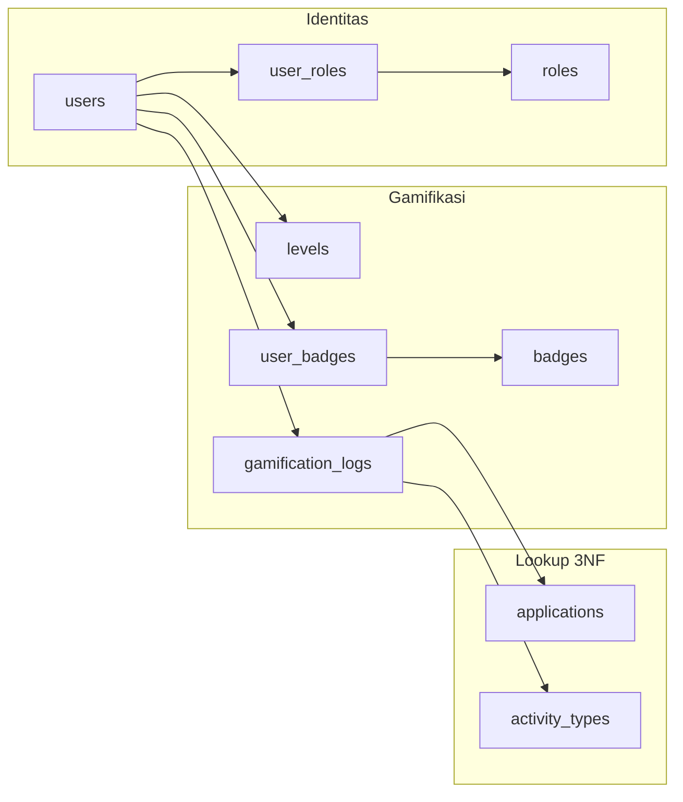

# 🗄️ JepangKu Core Backend — Database & Schema

**Canonical schema** untuk database **Core Service** (tim Sultan). File ini adalah sumber kebenaran ERD; repo LMS hanya mengonsumsi data via **JWT claims** + **Core API**.

| File | Kegunaan |
| :--- | :--- |
| [backend-core-services.prisma](./backend-core-services.prisma) | Schema Prisma (implementasi) |
| [core_dbdiagram.dbml](./core_dbdiagram.dbml) | Visual ERD di [dbdiagram.io](https://dbdiagram.io) |
| [CONCEPTS.md](./CONCEPTS.md) | **Penjelasan konsep:** `code`, `applications`, `activity_types` |
| [SCHEMA_REFERENCE.md](./SCHEMA_REFERENCE.md) | **Referensi per model & per field** (untuk tim Sultan) |
| [README.md](./README.md) | Dokumentasi ini — aturan bisnis, JWT, seed, alur |

### ⚠️ Aturan sinkronisasi Prisma ↔ DBML (wajib)

Kedua file di atas adalah **ERD yang sama**, format berbeda. **Harus selalu 1:1.**

| Prisma `model` | DBML `Table` | DB PostgreSQL |
| :--- | :--- | :--- |
| `Application` | `applications` | `applications` |
| `ActivityType` | `activity_types` | `activity_types` |
| `User` | `users` | `users` |
| `Role` | `roles` | `roles` |
| `UserRole` | `user_roles` | `user_roles` |
| `Level` | `levels` | `levels` |
| `Badge` | `badges` | `badges` |
| `UserBadge` | `user_badges` | `user_badges` |
| `GamificationLog` | `gamification_logs` | `gamification_logs` |
| `BadgeType` (enum) | `badge_type` (enum) | enum Postgres |

**Saat mengubah schema:**

1. Edit **keduanya** dalam satu PR/commit (atau sebutkan di changelog).
2. Bump `Schema version: X.Y.Z` di header **kedua** file.
3. Cek: kolom, nullable, unique, FK, index, enum — harus cocok (nama DB = `@@map` / snake_case di DBML).
4. **Tipe ID:** di DBML pakai `varchar` = Prisma `String` (Clerk ID & UUID string); bukan tipe `uuid` native DBML agar selaras migrasi.
5. Blok `Ref:` di DBML harus cocok dengan `@relation` + `onDelete` di Prisma.
6. Import ulang DBML ke dbdiagram.io untuk validasi visual.

**Versi saat ini:** `2.0.1`

**Konteks ekosistem:** [ECOSYSTEM.md](../ECOSYSTEM.md) · **Integrasi LMS:** [lib/core/](../../lib/core/)

> **Handoff Sultan:** Mulai dari [SCHEMA_REFERENCE.md](./SCHEMA_REFERENCE.md) untuk penjelasan tiap tabel & kolom; kembali ke README ini untuk JWT, idempotensi, dan seed.

---

## 1. Ringkasan domain



| Domain | Tabel | Tanggung jawab |
| :--- | :--- | :--- |
| **Identitas** | `users` | Profil global (sync Clerk); stats live untuk JWT |
| **Akses** | `roles`, `user_roles` | Admin LMS, editor berita, siswa default |
| **Level** | `levels` | Ambang XP kumulatif per level |
| **Badge** | `badges`, `user_badges` | Master maskot + yang sudah di-unlock |
| **Ledger** | `gamification_logs` | Audit + **idempotency** dari LMS/Berita |
| **Lookup** | `applications`, `activity_types` | Hindari string bebas di log |

---

## 2. Aturan bisnis penting

### 2.1 `users.id`

- **PK = Clerk User ID** (string), contoh `user_2bX9z…`
- Sama persis dengan `User.id` di **database LMS** (jangkar FK saja di LMS).

### 2.2 XP vs Poin

| Field | Perilaku |
| :--- | :--- |
| `total_xp` | Akumulasi seumur hidup — **tidak turun** |
| `current_points` | Saldo yang bisa **dibelanjakan** — boleh berkurang |
| `current_level` | Cache; dihitung ulang dari `total_xp` + baris `levels` |

### 2.3 Level (`levels.xp_required`)

**Definisi:** `xp_required` = minimum **`total_xp` kumulatif** untuk berada di `level_number` tersebut.

Contoh:

| level_number | xp_required | title |
| ---: | ---: | :--- |
| 1 | 0 | Pemula |
| 2 | 100 | … |
| 3 | 300 | … |

Saat insert `gamification_logs`, dalam **satu transaksi DB**:

1. Insert log (cek `idempotency_key` unik dulu).
2. Tambah `users.total_xp` / `users.current_points`.
3. Set `users.current_level` = `MAX(level_number)` where `xp_required <= users.total_xp`.
4. (Opsional) Issue JWT baru dengan claims terbaru.

### 2.4 Idempotensi (wajib untuk LMS)

Setiap award dari LMS **wajib** mengirim `idempotency_key` stabil, contoh:

```text
lms:quiz_attempt:550e8400-e29b-41d4-a716-446655440000
lms:lesson_complete:lesson_abc123
```

Duplikat key → Core mengembalikan hasil yang sama, **tanpa** double XP.

### 2.5 Soft delete

`users.deleted_at` di-set saat user dihapus di Clerk; query aktif filter `deleted_at IS NULL`.

---

## 3. JWT claims (payload dari tabel ini)

Core menerbitkan JWT berisi data user (bukan token kosong). Pemetaan indikatif:

| Claim JWT | Sumber kolom |
| :--- | :--- |
| `sub` | `users.id` |
| `email` | `users.email` |
| `name` | `users.name` |
| `picture` | `users.image_url` |
| `jepangku.totalXp` | `users.total_xp` |
| `jepangku.currentPoints` | `users.current_points` |
| `jepangku.level` | `users.current_level` |
| `jepangku.roles` | `user_roles` → `roles.code` |

Contoh:

```json
{
  "sub": "user_2abc",
  "email": "siswa@example.com",
  "name": "Kenji Tanaka",
  "picture": "https://…",
  "jepangku": {
    "totalXp": 7850,
    "currentPoints": 1200,
    "level": 12,
    "roles": ["STUDENT"]
  }
}
```

**Leaderboard** (data user lain) tetap via **Core API**, bukan JWT.

---

## 4. Seed data awal (disarankan)

### `applications`

| code | name |
| :--- | :--- |
| `LMS` | JepangKu LMS |
| `PORTAL_BERITA` | Portal Berita |

### `activity_types`

| code | description |
| :--- | :--- |
| `COMPLETED_QUIZ` | Menyelesaikan kuis di LMS |
| `COMPLETED_LESSON` | Mark lesson complete di LMS |
| `READ_ARTICLE` | Membaca artikel di Portal Berita |
| `DAILY_LOGIN` | Login harian |
| `MANUAL_ADJUST` | Koreksi admin |

### `roles`

| code | name |
| :--- | :--- |
| `STUDENT` | Siswa default |
| `LMS_ADMIN` | Admin CMS LMS |
| `NEWS_EDITOR` | Editor Portal Berita |
| `CORE_ADMIN` | Super admin Core |

### `levels`

Seed minimal level `1` dengan `xp_required = 0` agar FK `users.current_level` valid.

---

## 5. Alur dari LMS (contoh)

```text
1. Siswa login → Clerk (di Core) → JWT + claims ke LMS
2. LMS verify JWT → tampilkan nama/XP dari claims
3. LMS upsert User { id: sub } di DB LMS (jangkar FK)
4. Siswa selesai kuis → LMS simpan QuizAttempt lokal
5. LMS → Core POST award XP:
   - application: LMS
   - activity_type: COMPLETED_QUIZ
   - idempotency_key: lms:quiz_attempt:{attemptId}
   - source_ref_id: {attemptId}
6. Core insert gamification_logs + update users + return OK
```

---

## 6. Hubungan dengan [CORE_ERD.md](../CORE_ERD.md)

| Dokumen | Isi |
| :--- | :--- |
| **Folder ini** (`backend_core_services/`) | Schema **canonical** — Prisma, DBML, aturan bisnis, seed |
| **[SCHEMA_REFERENCE.md](./SCHEMA_REFERENCE.md)** | Definisi setiap model & field |
| **[CORE_ERD.md](../CORE_ERD.md)** | Konsep ringkas (~1 halaman): batas Core vs LMS, JWT, diagram logikal |

Jika ada perbedaan, **yang menang adalah file Prisma di folder ini**.

---

## 7. Menjalankan (repo Core Sultan)

```bash
# Di repo Core Backend (bukan LMS):
cp .env.example .env
bunx prisma db push
bunx prisma db seed
```

File Prisma ini memakai `DATABASE_URL` database **Core**, terpisah dari `DATABASE_URL` LMS.

---

## 8. Changelog schema

| Versi | Tanggal | Perubahan |
| :--- | :--- | :--- |
| 1.0 | 2026-06-03 | Draft awal (Kris): users, levels, badges, gamification_logs |
| 2.0 | 2026-06-03 | Roles, lookup tables, idempotency_key, badge.code, soft delete, README |
| 2.0.0 | 2026-06-03 | Sinkronisasi penuh Prisma ↔ DBML (enum, index, nullable); aturan 1:1 di README |
| 2.0.1 | 2026-06-03 | DBML: varchar IDs, Ref eksplisit + onDelete; Prisma: FK granted_by_user_id |
