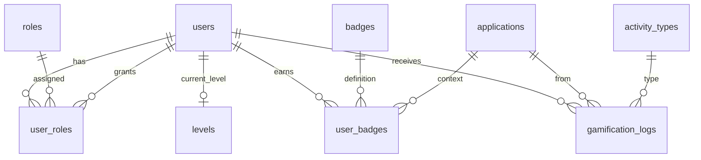

# 📖 JepangKu Core Backend — Referensi Model & Field

**Audience:** Tim Sultan (implementasi Core Backend).  
**Schema version:** `2.0.1` (selaras dengan [backend-core-services.prisma](./backend-core-services.prisma) dan [core_dbdiagram.dbml](./core_dbdiagram.dbml)).

Dokumen ini menjelaskan **setiap model Prisma**, **setiap field**, relasi, dan aturan bisnis. Untuk alur integrasi LMS/Berita, JWT, seed, dan changelog → [README.md](./README.md).

> Belum paham **`code`**, tabel **`applications`**, atau **`activity_types`**? Baca dulu [CONCEPTS.md](./CONCEPTS.md).

**Konteks ekosistem:** [ECOSYSTEM.md](../ECOSYSTEM.md) · Diagram visual: import [core_dbdiagram.dbml](./core_dbdiagram.dbml) ke [dbdiagram.io](https://dbdiagram.io).

---

## Cara membaca dokumen ini

| Kolom di tabel field | Arti |
| :--- | :--- |
| **Field (Prisma)** | Nama di kode TypeScript / Prisma Client |
| **Kolom DB** | Nama di PostgreSQL (`@@map`) |
| **Tipe** | Tipe Prisma |
| **Null?** | Boleh kosong di DB |
| **Default** | Nilai awal jika tidak diisi |
| **Fungsi** | Mengapa field ini ada |

**Konvensi ID**

- `User.id` = **Clerk User ID** (string), **tanpa** `@default(uuid())`.
- Model lain (`Application`, `Badge`, …) memakai UUID string via `@default(uuid())`.
- Di DBML, semua ID ditulis sebagai `varchar` = Prisma `String`.

**Yang tidak ada di database Core**

Artikel berita, kursus, soal kuis, enrollment, progress lesson → masing-masing di **DB aplikasi** (LMS / Portal Berita). Core hanya menyimpan identitas global, role, gamifikasi, dan audit ledger.

---

## Peta cepat semua model

| # | Model Prisma | Tabel PostgreSQL | Domain | Satu kalimat |
| ---: | :--- | :--- | :--- | :--- |
| — | `BadgeType` (enum) | `badge_type` | Badge | Kategori badge (LMS / Berita / global) |
| 1 | `Application` | `applications` | Lookup | Aplikasi sumber event (LMS, Berita, …) |
| 2 | `ActivityType` | `activity_types` | Lookup | Jenis aktivitas yang memberi XP/poin |
| 3 | `User` | `users` | Identitas | Profil global + stats live (JWT) |
| 4 | `Role` | `roles` | Akses | Definisi role (STUDENT, ADMIN, …) |
| 5 | `UserRole` | `user_roles` | Akses | Role yang dimiliki user (many-to-many) |
| 6 | `Level` | `levels` | Gamifikasi | Master ambang XP → level |
| 7 | `Badge` | `badges` | Gamifikasi | Master definisi badge / maskot |
| 8 | `UserBadge` | `user_badges` | Gamifikasi | Badge yang sudah di-unlock user |
| 9 | `GamificationLog` | `gamification_logs` | Ledger | Catatan setiap penambahan XP/poin (audit + idempotensi) |

---

## Enum: `BadgeType`

| Nilai | Kapan dipakai |
| :--- | :--- |
| `LMS_ACHIEVEMENT` | Badge dari pencapaian belajar (kuis, streak lesson, dll.) |
| `NEWS_CONTRIBUTOR` | Badge terkait Portal Berita (baca artikel, kontributor, dll.) |
| `GLOBAL` | Badge lintas aplikasi (event ekosistem, kampanye, dll.) |

Field terkait: `Badge.badgeType` → kolom `badges.badge_type`.

---

## 1. `Application` → `applications`

### Tujuan model

Mencatat **aplikasi mana** yang memicu event gamifikasi. Menghindari string bebas (`"lms"`, `"LMS"`, `"portal"`) di ledger dan badge — pola **lookup 3NF**.

### Relasi

| Relasi | Model | Arti |
| :--- | :--- | :--- |
| `gamificationLogs` | `GamificationLog[]` | Semua log XP dari app ini |
| `userBadges` | `UserBadge[]` | Badge yang di-unlock dalam konteks app (opsional) |

### Field

| Field (Prisma) | Kolom DB | Tipe | Null? | Default | Fungsi |
| :--- | :--- | :--- | :---: | :--- | :--- |
| `id` | `id` | String | ✗ | `uuid()` | PK internal |
| `code` | `code` | String | ✗ | — | Kode stabil untuk API & seed (`LMS`, `PORTAL_BERITA`, `LPK`) |
| `name` | `name` | String | ✗ | — | Label tampilan ("JepangKu LMS") |

### Seed disarankan

| `code` | `name` |
| :--- | :--- |
| `LMS` | JepangKu LMS |
| `PORTAL_BERITA` | Portal Berita |

### Contoh pemakaian

Saat LMS memanggil API award XP, kirim `applicationId` dari baris `applications` where `code = 'LMS'` (atau resolve `code` di server Core).

---

## 2. `ActivityType` → `activity_types`

### Tujuan model

Mendefinisikan **jenis aktivitas** yang boleh menambah XP/poin. Setiap baris di `gamification_logs` wajib merujuk ke satu `activity_type` — memudahkan laporan ("berapa XP dari kuis vs artikel").

### Relasi

| Relasi | Model |
| :--- | :--- |
| `gamificationLogs` | `GamificationLog[]` |

### Field

| Field (Prisma) | Kolom DB | Tipe | Null? | Default | Fungsi |
| :--- | :--- | :--- | :---: | :--- | :--- |
| `id` | `id` | String | ✗ | `uuid()` | PK |
| `code` | `code` | String | ✗ | — | Kode stabil (`COMPLETED_QUIZ`, `READ_ARTICLE`, …) |
| `description` | `description` | Text | ✓ | — | Penjelasan manusia untuk admin / dokumentasi |

### Seed disarankan

| `code` | Keterangan singkat |
| :--- | :--- |
| `COMPLETED_QUIZ` | Kuis selesai di LMS |
| `COMPLETED_LESSON` | Lesson ditandai selesai di LMS |
| `READ_ARTICLE` | Artikel dibaca di Portal Berita |
| `DAILY_LOGIN` | Login harian (opsional) |
| `MANUAL_ADJUST` | Koreksi manual admin Core |

**Menambah jenis baru:** cukup insert baris baru + dokumentasikan di API — **tanpa** ubah struktur tabel.

---

## 3. `User` → `users`

### Tujuan model

**Satu baris = satu manusia** di ekosistem JepangKu (identitas Clerk). Menyimpan profil yang masuk JWT dan statistik gamifikasi **live** (bukan tabel terpisah `user_stats`).

Sama dengan `User.id` di database LMS — tetapi di LMS hanya jangkar FK (`id` + `createdAt`), tanpa email/XP.

### Relasi

| Relasi | Model | Catatan |
| :--- | :--- | :--- |
| `level` | `Level` | FK `current_level` → `levels.level_number` |
| `userRoles` | `UserRole[]` | Role sebagai member (`UserRoleMember`) |
| `rolesGrantedByUser` | `UserRole[]` | Role yang **diberikan oleh** user ini ke orang lain (`UserRoleGrantedBy`) |
| `userBadges` | `UserBadge[]` | Badge yang dimiliki |
| `gamificationLogs` | `GamificationLog[]` | Riwayat penambahan XP/poin |

### Field

| Field (Prisma) | Kolom DB | Tipe | Null? | Default | Fungsi |
| :--- | :--- | :--- | :---: | :--- | :--- |
| `id` | `id` | String | ✗ | — | **Clerk User ID** — PK, tidak auto-generate |
| `email` | `email` | String | ✗ | — | Email unik; sync dari Clerk |
| `name` | `name` | String | ✗ | — | Nama tampilan; sync dari Clerk |
| `imageUrl` | `image_url` | String | ✓ | — | URL avatar; claim JWT `picture` |
| `totalXp` | `total_xp` | Int | ✗ | `0` | XP **kumulatif seumur hidup** — tidak pernah dikurangi |
| `currentPoints` | `current_points` | Int | ✗ | `0` | Saldo **poin** yang bisa ditukar/dibelanjakan — boleh berkurang |
| `currentLevel` | `current_level` | Int | ✗ | `1` | **Cache** level saat ini; harus di-update dalam transaksi yang sama dengan `gamification_logs` |
| `clerkSyncedAt` | `clerk_synced_at` | DateTime | ✓ | — | Terakhir profil diselaraskan dari Clerk (webhook/cron) |
| `createdAt` | `created_at` | DateTime | ✗ | `now()` | Waktu registrasi di Core |
| `updatedAt` | `updated_at` | DateTime | ✗ | auto | Terakhir baris di-update (Prisma `@updatedAt`) |
| `deletedAt` | `deleted_at` | DateTime | ✓ | — | **Soft delete** — set saat user dihapus di Clerk |

### Index

- `users_deleted_at_idx` pada `deleted_at` — query user aktif: `WHERE deleted_at IS NULL`.

### Aturan bisnis

1. **XP vs poin:** `total_xp` untuk level & leaderboard; `current_points` untuk ekonomi reward terpisah.
2. **Level:** setelah tambah `total_xp`, hitung `current_level = MAX(level_number)` dari `levels` where `xp_required <= total_xp`.
3. **Query default:** jangan tampilkan user dengan `deleted_at` terisi.

### Pemetaan JWT (indikatif)

| Claim | Field |
| :--- | :--- |
| `sub` | `id` |
| `email` | `email` |
| `name` | `name` |
| `picture` | `image_url` |
| `jepangku.totalXp` | `total_xp` |
| `jepangku.currentPoints` | `current_points` |
| `jepangku.level` | `current_level` |
| `jepangku.roles` | via `user_roles` → `roles.code` |

---

## 4. `Role` → `roles`

### Tujuan model

**Katalog role** di ekosistem. Role tidak disimpan sebagai string di `users` — dipisah agar admin bisa menambah role tanpa migrasi kolom.

### Relasi

| Relasi | Model |
| :--- | :--- |
| `userRoles` | `UserRole[]` |

### Field

| Field (Prisma) | Kolom DB | Tipe | Null? | Default | Fungsi |
| :--- | :--- | :--- | :---: | :--- | :--- |
| `id` | `id` | String | ✗ | `uuid()` | PK internal |
| `code` | `code` | String | ✗ | — | Kode untuk JWT & middleware (`STUDENT`, `LMS_ADMIN`, …) |
| `name` | `name` | String | ✗ | — | Label UI ("Siswa", "Admin LMS") |
| `description` | `description` | Text | ✓ | — | Dokumentasi internal |

### Seed disarankan

| `code` | Peran |
| :--- | :--- |
| `STUDENT` | Default semua user belajar |
| `LMS_ADMIN` | Akses CMS / admin di LMS |
| `NEWS_EDITOR` | Editor konten Portal Berita |
| `CORE_ADMIN` | Super admin layanan Core |

Satu user bisa punya **beberapa** role (lihat `UserRole`).

---

## 5. `UserRole` → `user_roles`

### Tujuan model

**Junction table** many-to-many antara `User` dan `Role`. Mencatat kapan role diberikan dan (opsional) admin pemberi role.

### Primary key

Composite: `(user_id, role_id)` — satu user tidak bisa punya duplikat role yang sama.

### Relasi

| Relasi | Nama Prisma | `onDelete` |
| :--- | :--- | :--- |
| `user` | `UserRoleMember` | Cascade (hapus user → hapus assignment role) |
| `role` | — | Cascade |
| `grantedByUser` | `UserRoleGrantedBy` | SetNull (hapus admin pemberi → kolom jadi null) |

### Field

| Field (Prisma) | Kolom DB | Tipe | Null? | Default | Fungsi |
| :--- | :--- | :--- | :---: | :--- | :--- |
| `userId` | `user_id` | String | ✗ | — | FK → `users.id` (Clerk ID) — bagian PK |
| `roleId` | `role_id` | String | ✗ | — | FK → `roles.id` — bagian PK |
| `grantedAt` | `granted_at` | DateTime | ✗ | `now()` | Waktu role diberikan |
| `grantedByUserId` | `granted_by_user_id` | String | ✓ | — | FK → `users.id` admin yang memberi role (audit) |

### Aturan bisnis

- User baru dari Clerk: seed otomatis `STUDENT` (disarankan di webhook/register).
- `CORE_ADMIN` memberi `LMS_ADMIN` / `NEWS_EDITOR` lewat panel atau API internal.

---

## 6. `Level` → `levels`

### Tujuan model

**Master data** kurva leveling. Bukan progress per user — progress ada di `users.total_xp` + cache `users.current_level`.

### Relasi

| Relasi | Model |
| :--- | :--- |
| `users` | `User[]` | Semua user yang saat ini di level ini (`current_level`) |

### Field

| Field (Prisma) | Kolom DB | Tipe | Null? | Default | Fungsi |
| :--- | :--- | :--- | :---: | :--- | :--- |
| `levelNumber` | `level_number` | Int | ✗ | — | **PK** — angka level (1, 2, 3, …) |
| `xpRequired` | `xp_required` | Int | ✗ | — | Minimum **`total_xp` kumulatif** untuk berada di level ini (unique) |
| `title` | `title` | String | ✓ | — | Judul tampilan ("Pemula", "N5 Warrior", …) |

### Definisi penting

`xp_required` = ambang **total XP seumur hidup**, bukan XP yang dibutuhkan **antar** level.

Contoh:

| `level_number` | `xp_required` |
| ---: | ---: |
| 1 | 0 |
| 2 | 100 |
| 3 | 300 |

User dengan `total_xp = 250` → `current_level = 2`.

### Seed wajib

Minimal satu baris: `level_number = 1`, `xp_required = 0` — agar FK default `users.current_level = 1` valid.

---

## 7. `Badge` → `badges`

### Tujuan model

**Katalog badge** (maskot JepangKu): definisi visual + metadata. Apakah user sudah punya badge → tabel `user_badges`.

### Relasi

| Relasi | Model |
| :--- | :--- |
| `userBadges` | `UserBadge[]` |

### Field

| Field (Prisma) | Kolom DB | Tipe | Null? | Default | Fungsi |
| :--- | :--- | :--- | :---: | :--- | :--- |
| `id` | `id` | String | ✗ | `uuid()` | PK |
| `code` | `code` | String | ✗ | — | Kode stabil untuk unlock programmatic (`KUTU_BUKU`, `NIGHT_LEARNER`) |
| `title` | `title` | String | ✗ | — | Judul badge di UI |
| `description` | `description` | Text | ✗ | — | Deskripsi pencapaian |
| `imageUrl` | `image_url` | String | ✗ | — | URL gambar badge |
| `badgeType` | `badge_type` | BadgeType | ✗ | — | Kategori LMS / Berita / global |
| `isActive` | `is_active` | Boolean | ✗ | `true` | `false` = tidak bisa di-unlock lagi (badge retired) |
| `createdAt` | `created_at` | DateTime | ✗ | `now()` | Waktu badge dibuat di sistem |

### Aturan bisnis

- Unlock: insert ke `user_badges` (cek unique `user_id + badge_id`).
- Logic "kapan unlock" hidup di **Core service** atau worker — bisa trigger dari `gamification_logs` atau API terpisah.

---

## 8. `UserBadge` → `user_badges`

### Tujuan model

Mencatat **badge yang sudah dimiliki user** (junction + metadata konteks unlock).

### Relasi

| Relasi | `onDelete` |
| :--- | :--- |
| `user` | Cascade |
| `badge` | Cascade |
| `application` | SetNull |

### Field

| Field (Prisma) | Kolom DB | Tipe | Null? | Default | Fungsi |
| :--- | :--- | :--- | :---: | :--- | :--- |
| `id` | `id` | String | ✗ | `uuid()` | PK baris unlock |
| `userId` | `user_id` | String | ✗ | — | FK → user pemilik badge |
| `badgeId` | `badge_id` | String | ✗ | — | FK → definisi badge |
| `applicationId` | `application_id` | String | ✓ | — | App mana badge ini relevan (null = global / tidak spesifik) |
| `sourceRefId` | `source_ref_id` | String | ✓ | — | ID entitas di DB app sumber (mis. `lesson_id`, `article_id`) — **bukan** FK cross-database |
| `unlockedAt` | `unlocked_at` | DateTime | ✗ | `now()` | Waktu unlock |

### Constraint

- **Unique:** `(user_id, badge_id)` — satu user hanya satu kali per badge.

---

## 9. `GamificationLog` → `gamification_logs`

### Tujuan model

**Ledger audit** setiap kali XP/poin ditambahkan ke user. Sumber kebenaran historis; `users.total_xp` adalah agregat yang di-update dari sini.

Wajib untuk integrasi **multi-app** (LMS + Portal Berita) dengan **idempotensi** — client mengirim key yang sama → tidak double award.

### Relasi

| Relasi | `onDelete` |
| :--- | :--- |
| `user` | Cascade |
| `application` | Restrict (default) |
| `activityType` | Restrict (default) |

### Field

| Field (Prisma) | Kolom DB | Tipe | Null? | Default | Fungsi |
| :--- | :--- | :--- | :---: | :--- | :--- |
| `id` | `id` | String | ✗ | `uuid()` | PK log |
| `userId` | `user_id` | String | ✗ | — | User yang menerima XP/poin |
| `applicationId` | `application_id` | String | ✗ | — | App pemicu event |
| `activityTypeId` | `activity_type_id` | String | ✗ | — | Jenis aktivitas |
| `xpGained` | `xp_gained` | Int | ✗ | `0` | XP ditambahkan pada transaksi ini |
| `pointsGained` | `points_gained` | Int | ✗ | `0` | Poin ditambahkan pada transaksi ini |
| `sourceRefId` | `source_ref_id` | String | ✓ | — | ID di DB client (QuizAttempt, Article, …) — referensi longgar |
| `idempotencyKey` | `idempotency_key` | String | ✗ | — | **Unique** — kunci idempotensi dari client |
| `createdAt` | `created_at` | DateTime | ✗ | `now()` | Waktu event |

### Index

- `(user_id, created_at DESC)` — riwayat XP user, leaderboard internal, support.

### Transaksi wajib (satu DB transaction)

```text
1. SELECT / INSERT gamification_logs WHERE idempotency_key = ?
   - Jika key sudah ada → return response idempotent (jangan update user lagi)
2. INSERT log baru
3. UPDATE users SET total_xp += xp_gained, current_points += points_gained
4. RECALCULATE users.current_level dari tabel levels
5. (Opsional) trigger issue JWT baru / unlock badge
```

### Format `idempotency_key` (konvensi)

| App | Contoh |
| :--- | :--- |
| LMS | `lms:quiz_attempt:{attemptUuid}` |
| LMS | `lms:lesson_complete:{lessonId}` |
| Berita | `berita:article_read:{articleId}:{userId}` |

Prefix + ID stabil dari **sisi client** — jangan pakai timestamp acak.

### Field `source_ref_id` vs `idempotency_key`

| Field | Peran |
| :--- | :--- |
| `idempotency_key` | Mencegah **duplikasi insert** (technical dedup) |
| `source_ref_id` | Jejak **bisnis** ke record di DB LMS/Berita (debug, laporan) |

Keduanya boleh berisi ID yang sama secara konsep, tetapi key idempotensi harus **unik global** di seluruh Core.

---

## Diagram relasi (ringkas)



---

## Checklist implementasi untuk Sultan

- [ ] Baca model `User` dulu — PK Clerk, soft delete, XP vs poin.
- [ ] Seed `applications`, `activity_types`, `roles`, minimal `levels` (level 1).
- [ ] Webhook Clerk: upsert `users`, assign `STUDENT`, set `clerk_synced_at`.
- [ ] API award XP: transaksi + `idempotency_key` + update `users` + JWT refresh policy.
- [ ] JWT claims sesuai tabel di README §3.
- [ ] Jangan simpan artikel/kursus di Core DB.
- [ ] Setiap ubah kolom: edit Prisma + DBML bersamaan ([README](./README.md) § sinkronisasi).

---

## Dokumen terkait

| File | Isi |
| :--- | :--- |
| [README.md](./README.md) | Aturan bisnis, JWT, seed, alur LMS, changelog |
| [backend-core-services.prisma](./backend-core-services.prisma) | Schema implementasi |
| [core_dbdiagram.dbml](./core_dbdiagram.dbml) | ERD visual |
| [CORE_ERD.md](../CORE_ERD.md) | Konsep arsitektur 1 halaman |
| [ECOSYSTEM.md](../ECOSYSTEM.md) | Batas LMS vs Core vs Berita |

| Versi doc | Tanggal | Catatan |
| :--- | :--- | :--- |
| 1.0 | 2026-06-03 | Referensi model & field untuk tim Sultan |
