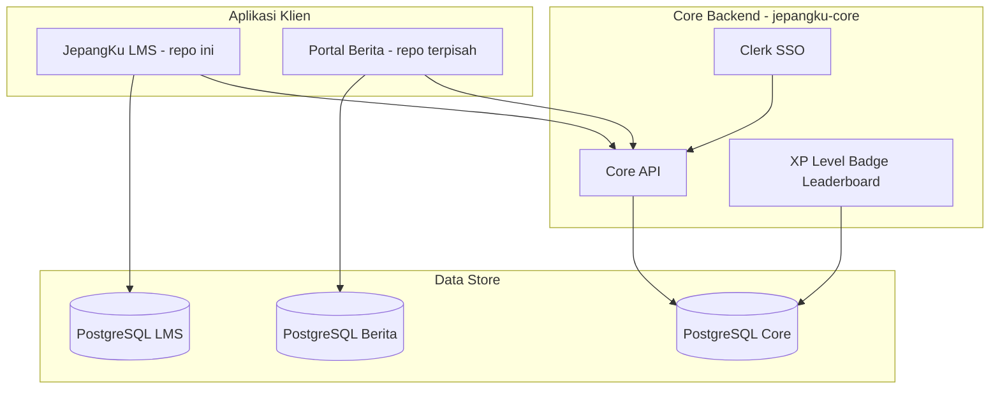

# 01 — Ringkasan Proyek

## Apa itu JepangKu LMS?

**JepangKu LMS** adalah platform pembelajaran bahasa Jepang berfokus persiapan **JLPT (N5–N1)**. Aplikasi ini merupakan bagian dari ekosistem JepangKu dan di-host di subdomain **`kursus.jepangku.com`**.

Fitur utama:

- **Kursus terstruktur** — modul, pelajaran (video, flashcard, kuis, teks), progress belajar
- **Tryout JLPT** — simulasi ujian per level dengan blok Moji-Goi, Bunpou/Dokkai, Choukai
- **Live Class** — jadwal kelas Zoom dengan enrollment
- **Tes Penempatan** — penempatan level siswa (sebagian masih stub)
- **Kana** — chart Hiragana/Katakana interaktif
- **Gamifikasi** — XP, level, badge, leaderboard (data dari Core Backend)
- **Monetisasi** — checkout per item via Midtrans (kursus, live class, tryout)

---

## Scope repo ini

| Termasuk (repo ini) | Di luar repo ini |
| :--- | :--- |
| Konten & progress belajar LMS | Core Backend (SSO, profil global, gamifikasi engine) |
| Admin CMS kursus/tryout/pembayaran | Portal Berita (`jepangku.com`) |
| UI leaderboard & profil siswa | Webhook Clerk utama (target: Core) |
| Partner API katalog read-only | |

Konteks bisnis lebih luas: [JepangKu x Webekspres.md](../JepangKu%20x%20Webekspres.md), [Proposal Project Development JepangKu.md](../Proposal%20Project%20Development%20JepangKu.md).

---

## Ekosistem (ringkas)

Detail lengkap: [ECOSYSTEM.md](../ECOSYSTEM.md).

---

## Peran pengguna

| Peran | Akses | Gate |
| :--- | :--- | :--- |
| **Guest** | Marketing (`/`, `/kursus`, `/tryout`, dll.) | Tidak perlu login |
| **Student** | `/dashboard/*` | Clerk session (`proxy.ts`) |
| **Admin** | `/admin/*` | Clerk + role `LMS_ADMIN` (DB LMS) atau Core JWT roles |

Admin gate diimplementasi di `proxy.ts` via `canAccessLmsAdminPanel()` — lihat `lib/auth/lms-roles.ts`.

---

## Area produk & routing utama

Referensi URL lengkap: [sitemap.md](../../sitemap.md).

### Public & marketing

| Route | Fungsi |
| :--- | :--- |
| `/` | Landing page |
| `/kursus`, `/kursus/[slug]` | Katalog & detail kursus publik |
| `/live-class/[id]` | Detail live class publik |
| `/tryout`, `/tryout/[sessionCode]` | Info tryout & detail sesi |
| `/tes-penempatan` | Info tes penempatan |
| `/tentang`, `/cara-belajar`, `/hubungi`, legal | Halaman statis |

### Auth

| Route | Fungsi |
| :--- | :--- |
| `/sign-in`, `/sign-up` | Login/daftar via Clerk (Google OAuth didukung) |

### Student (`/dashboard/*`)

| Route | Fungsi |
| :--- | :--- |
| `/dashboard` | Hub utama — lanjut belajar, jalur JLPT, XP mingguan |
| `/dashboard/kursus`, `/dashboard/kursus-saya` | Katalog & kursus terdaftar |
| `/dashboard/belajar/[courseSlug]/[lessonSlug]` | Workspace belajar (video, materi, kuis inline, Q&A) |
| `/dashboard/tryout/*` | Pilih sesi, ujian fokus, hasil & analisa |
| `/dashboard/live-class/*` | Jadwal & detail + Zoom |
| `/dashboard/tes-penempatan/*` | Hub, ujian, hasil (partial) |
| `/dashboard/kana/hiragana`, `/katakana` | Chart aksara |
| `/dashboard/leaderboard`, `/profil`, `/achievements` | Gamifikasi & profil |
| `/dashboard/checkout/*`, `/pembayaran/*` | Checkout & riwayat pembayaran |

### Admin (`/admin/*`)

| Route | Fungsi |
| :--- | :--- |
| `/admin/dashboard` | Executive dashboard (KPI, Recharts) |
| `/admin/kursus/*` | CRUD kursus, modul, lesson workspace, import Excel |
| `/admin/tryout/*` | Sesi tryout, paket soal, import ZIP |
| `/admin/live-class` | CRUD jadwal live class |
| `/admin/pembayaran` | Antrian enrollment + riwayat Midtrans |
| `/admin/badges` | Katalog badge LMS + grant manual |
| `/admin/settings` | Integrasi GA4 / Search Console |

---

## Model bisnis (pembayaran)

- **Checkout per item** — tidak ada shopping cart
- Produk: `Course`, `LiveClass`, `TryoutSession`
- Gratis → enrollment langsung ACTIVE; berbayar → Midtrans (Snap atau Core API)
- Admin dapat **grant** akses manual tanpa pembayaran

Detail: [PAYMENT_MODEL.md](../PAYMENT_MODEL.md).

---

## Status proyek (snapshot)

| Meta | Nilai |
| :--- | :--- |
| Fase | 1 (MVP) |
| Progres global | **89%** |
| Target MVP | Akhir Juni 2026 |

Ringkasan detail: [04-implementation-status.md](./04-implementation-status.md).
