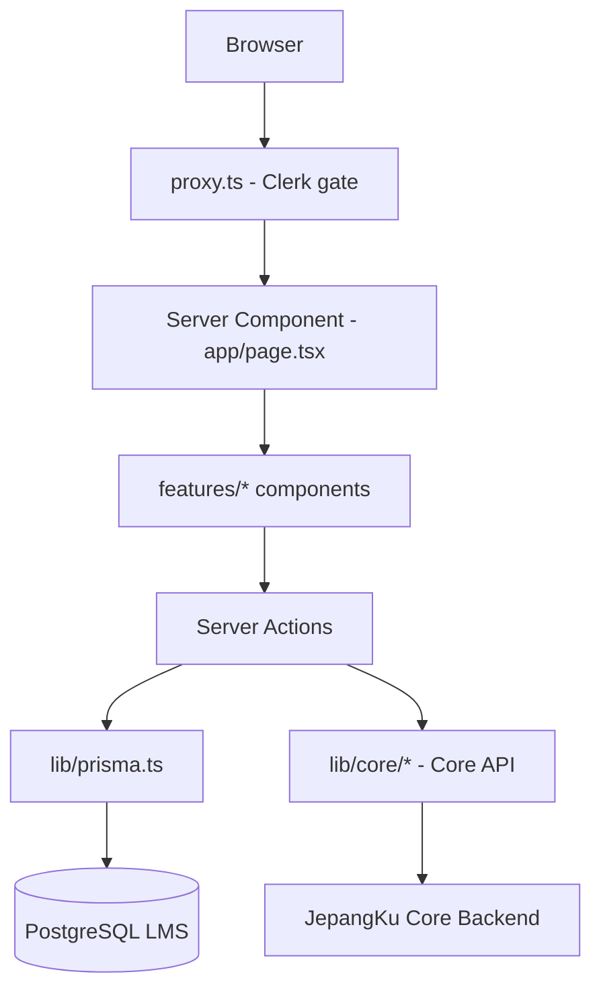

# 03 — Arsitektur Sistem

Dokumen ini merangkum pola arsitektur LMS. Detail lengkap: [ARCHITECTURE.md](../ARCHITECTURE.md).

---

## Pola utama: Feature-Based (Domain-Driven)

```text
app/          → Routing tipis (RSC "resepsionis")
features/     → Logika bisnis, Server Actions, UI domain
components/   → Primitif shared (Shadcn UI)
lib/          → Infrastruktur (prisma, core, auth, payment-engine)
prisma/       → Schema PostgreSQL LMS
```

**Aturan keras:**

1. `app/**/page.tsx` tidak boleh berisi logic DB rumit atau UI kompleks — panggil wrapper dari `features/`.
2. Setiap domain bisnis punya folder sendiri di `features/`.
3. Profil/XP user **tidak** di-query dari Prisma — gunakan `lib/core/`.

---

## Alur request (ringkas)



### Pola data fetching

| Kebutuhan | Pola |
| :--- | :--- |
| Initial load halaman | Query Prisma langsung di RSC |
| Mutasi data | Server Actions di `features/*/actions/` |
| UI interaktif + refresh | TanStack Query (terbatas) |
| State kuis sementara | Zustand (`features/quiz-engine/store/`) |
| Profil/XP user aktif | JWT claims via `getCoreSession()` |
| Leaderboard orang lain | Core API via `lib/core/api.ts` |

---

## Struktur folder utama

```text
jepangkuLMS/
├── app/
│   ├── (authentication)/     # sign-in, sign-up, auth/complete
│   ├── (marketing)/          # /, /kursus, /tryout, legal, dll.
│   ├── (student)/            # /dashboard/*
│   ├── (admin)/              # /admin/*
│   └── api/                  # webhooks, auth, payments SSE, cron, partner API
├── features/                 # Domain logic (lihat tabel di bawah)
├── components/
│   ├── ui/                   # Shadcn primitif
│   ├── layout/               # Navbar, sidebar
│   └── providers/            # QueryProvider, dll.
├── lib/
│   ├── prisma.ts             # Singleton Prisma + pg Pool
│   ├── core/                 # Abstraksi Core Backend
│   ├── auth/                 # Clerk helpers, lms-roles, sync-user-anchor
│   ├── payment-engine/       # Midtrans provider port
│   ├── email/                # Resend + templates
│   ├── media/                # R2 upload/cleanup
│   └── validations/          # Zod schemas
├── emails/                   # React Email templates
├── prisma/                   # schema.prisma, seed, migrations
├── proxy.ts                  # Auth gate (ganti middleware)
└── docs/                     # Dokumentasi
```

---

## Peta domain `features/`

| Domain | Folder | Tanggung jawab | Status |
| :--- | :--- | :--- | :---: |
| **learning** | `features/learning/` | Kursus, lesson, video, progress, Q&A nested, marketing queries | ✅ |
| **admin-cms** | `features/admin-cms/` | CRUD kursus/modul/lesson, import, enrollment admin, badge grant, executive dashboard | ✅ |
| **student** | `features/student/` | Dashboard, profil, leaderboard UI, core data hydrate, reward notifications | ✅ |
| **tryout** | `features/tryout/` | Ujian JLPT, paket soal, Choukai audio, hasil & analisa | ✅ |
| **placement** | `features/placement/` | Tes penempatan hub/ujian/hasil | 🟡 |
| **live-class** | `features/live-class/` | Jadwal Zoom, enrollment, detail siswa | ✅ |
| **gamification** | `features/gamification/` | UI badge/XP — data dari Core | ✅ |
| **payment** | `features/payment/` | Riwayat pembayaran, invoice, SSE events | ✅ |
| **checkout** | `features/checkout/` | Checkout per item (kursus/live/tryout) | ✅ |
| **kana** | `features/kana/` | Chart Hiragana/Katakana, FAB launcher, modal detail | 🟡 |
| **public-api** | `features/public-api/` | Partner API katalog read-only | ✅ |
| **quiz-engine** | `features/quiz-engine/` | State kuis, navigasi soal | 🟡 |
| **auth** | `features/auth/` | Login page, CoreSessionSync | ✅ |
| **marketing** | `features/marketing/` | Landing page components | 🟡 |

---

## Route groups & URL

| Route group | URL prefix | Layout |
| :--- | :--- | :--- |
| `(marketing)` | `/`, `/kursus`, `/tryout`, … | Marketing nav + footer |
| `(student)` | `/dashboard/*` | Student shell + sidebar + Core hydrate |
| `(admin)` | `/admin/*` | Admin shell + sidebar |
| `(authentication)` | `/sign-in`, `/sign-up` | Auth minimal |

**SSOT routing:** [sitemap.md](../../sitemap.md)

---

## Layer shared kunci

### `proxy.ts`

- Gate **Clerk-only** untuk `/dashboard/*` dan `/admin/*`
- Redirect post-login via `?redirect_url=` (path internal aman saja)
- Admin: `canAccessLmsAdminPanel()` — role dari Core JWT + `LMS_ADMIN` di DB

### `lib/core/`

Abstraksi semua komunikasi ke Core Backend. UI **tidak** import HTTP langsung ke Core.

| File | Peran |
| :--- | :--- |
| `jwt-claims.ts` | Parse & map claims JWT → profil/XP |
| `session.ts` | `buildSessionFromVerifiedJwt()`, `hasRole()` |
| `get-core-session.ts` | `getCoreSession()` — entry point server |
| `gamification.ts` | `awardLmsXp()` — award XP ke Core (outbox pattern) |
| `api.ts` | REST: leaderboard, badges, `/users/me` |
| `client.ts` | Base URL, konfigurasi API |
| `activity-map.ts` | Idempotency key & activity type mapping |

Detail integrasi: [05-core-integration.md](./05-core-integration.md).

### `lib/payment-engine/`

Provider port untuk Midtrans — Snap dan Core API charge. Settlement SoT selalu webhook.

Detail: [PAYMENT_MODEL.md](../PAYMENT_MODEL.md).

### `lib/prisma.ts`

Satu-satunya instansiasi `PrismaClient` + `PrismaPg` adapter.

---

## Pola admin CMS

Tabel admin wajib pakai pagination konsisten:

| Item | Lokasi |
| :--- | :--- |
| Hook | `features/admin-cms/hooks/use-admin-table-pagination.ts` |
| UI footer | `features/admin-cms/components/admin-table-pagination.tsx` |
| Konstanta | `ADMIN_TABLE_PAGE_SIZE_OPTIONS` = 5, 10, 15, 25, 100 (default 10) |

---

## Konvensi coding

| Dokumen | Isi |
| :--- | :--- |
| [AGENTS.md](../../AGENTS.md) | Aturan Agent, ekosistem, Prisma, email |
| [DESIGN.md](../../DESIGN.md) | Palet, tipografi, pola komponen |
| [LESSON_CONTENT_ARCHITECTURE.md](../LESSON_CONTENT_ARCHITECTURE.md) | Tipe lesson (VIDEO/FLASHCARD/QUIZ/TEXT) |
