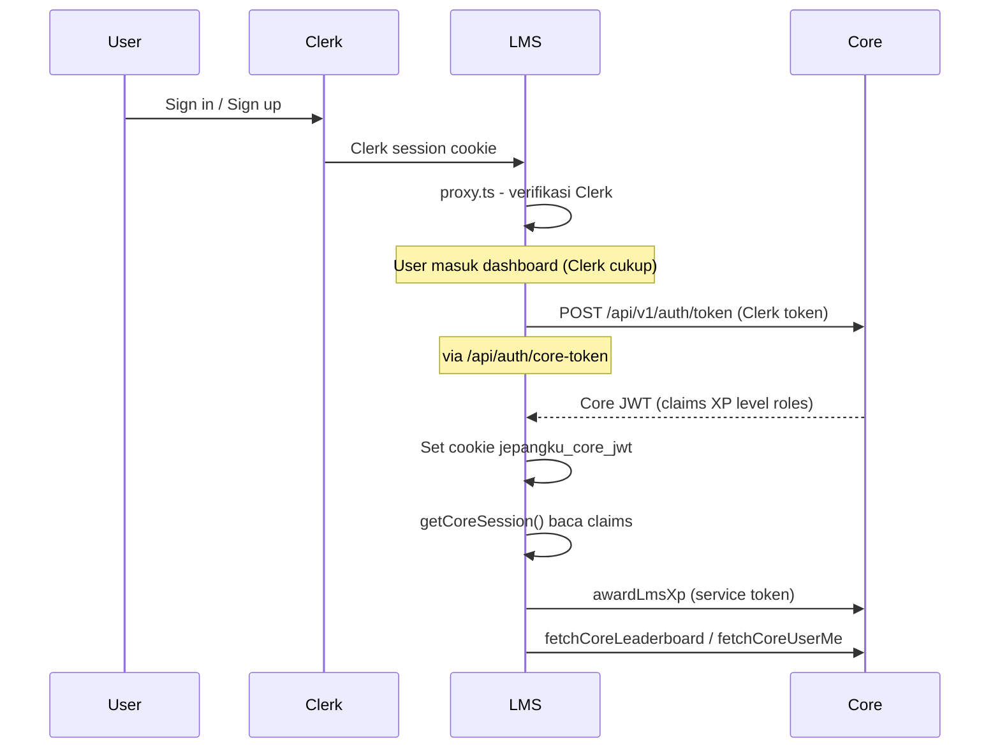

# 05 — Integrasi Core Backend

Dokumen ini menjelaskan bagaimana **JepangKu LMS** berkomunikasi dengan **JepangKu Core Backend** (`jepangku-core`). Bagian kritis untuk tim dev karena melibatkan auth, profil, dan gamifikasi.

Dokumen terkait:

- [ECOSYSTEM.md](../ECOSYSTEM.md) — batas tanggung jawab
- [CORE_INTEGRATION_STATUS.md](../CORE_INTEGRATION_STATUS.md) — status & blocker historis
- [CORE_ERD.md](../CORE_ERD.md) — konsep DB Core
- [jepangku-core/docs/](../../jepangku-core/docs/) — schema canonical Core

---

## Prinsip integrasi

| Aturan | Penjelasan |
| :--- | :--- |
| **Clerk-first gate** | Login wajib Clerk; gagal Core **tidak** memblokir dashboard |
| **JWT untuk baca** | Profil/XP/roles user aktif dari claims JWT Core |
| **API untuk tulis** | Award XP ke Core via REST + service token + idempotency key |
| **User jangkar lokal** | `User.id` di Prisma = Clerk/Core ID; bukan sumber profil |
| **Best-effort sync** | `CoreSessionSync` background; UX tetap usable jika Core down |

---

## Diagram alur auth



### Target jangka panjang vs implementasi saat ini

| Aspek | Target ekosistem | Implementasi LMS saat ini |
| :--- | :--- | :--- |
| Gate login | Core JWT wajib | **Clerk saja** (Core non-blocking) |
| Profil UI | Core JWT claims | Clerk + Core claims (hybrid) |
| Data belajar | DB LMS | ✅ DB LMS |
| Award XP | Core API | ✅ `awardLmsXp()` wired |
| Leaderboard global | Core API | 🟡 Public top-N; user stats butuh JWT |

---

## File kode integrasi

| File | Peran |
| :--- | :--- |
| [`proxy.ts`](../../proxy.ts) | Gate Clerk untuk `/dashboard`, `/admin`; admin via `canAccessLmsAdminPanel()` |
| [`app/api/auth/core-token/route.ts`](../../app/api/auth/core-token/route.ts) | Proxy Clerk → Core `POST /api/v1/auth/token`; set cookie JWT |
| [`features/auth/components/core-session-sync.tsx`](../../features/auth/components/core-session-sync.tsx) | Background sync setelah login (non-blocking) |
| [`app/(authentication)/auth/complete/page.tsx`](../../app/(authentication)/auth/complete/page.tsx) | Halaman retry manual (opsional) |
| [`lib/core/jwt-claims.ts`](../../lib/core/jwt-claims.ts) | Parse & map `JepangKuJwtClaims` → profil/XP |
| [`lib/core/session.ts`](../../lib/core/session.ts) | `buildSessionFromVerifiedJwt()`, `hasRole()` |
| [`lib/core/get-core-session.ts`](../../lib/core/get-core-session.ts) | `getCoreSession()` — entry point server |
| [`lib/core/verify-jwt.ts`](../../lib/core/verify-jwt.ts) | Verifikasi signature JWT dengan public key |
| [`lib/core/gamification.ts`](../../lib/core/gamification.ts) | `awardLmsXp()` — tidak throw; outbox-friendly |
| [`lib/core/api.ts`](../../lib/core/api.ts) | REST client: leaderboard, badges, `/users/me` |
| [`lib/core/activity-map.ts`](../../lib/core/activity-map.ts) | Idempotency key & activity type mapping |
| [`lib/core/client.ts`](../../lib/core/client.ts) | `getCoreApiBaseUrl()`, `isCoreApiConfigured()` |
| [`lib/core/integration-config.ts`](../../lib/core/integration-config.ts) | Feature flags integrasi UI |
| [`lib/auth/sync-user-anchor.ts`](../../lib/auth/sync-user-anchor.ts) | Upsert `User` jangkar di DB LMS |
| [`lib/auth/lms-roles.ts`](../../lib/auth/lms-roles.ts) | Role LMS: `LMS_ADMIN`, `STUDENT`, admin bypass dev |
| [`features/student/lib/load-student-core-data.ts`](../../features/student/lib/load-student-core-data.ts) | Loader data gamifikasi untuk dashboard |
| [`features/student/components/student-core-data-hydrator.tsx`](../../features/student/components/student-core-data-hydrator.tsx) | Hydrate client context dari Core data |

---

## JWT claims (indikatif)

Setelah token exchange sukses, JWT Core berisi claims seperti:

```json
{
  "sub": "user_2abc…",
  "email": "siswa@example.com",
  "name": "Kenji Tanaka",
  "picture": "https://…",
  "jepangku": {
    "displayName": "Kenji Tanaka",
    "avatarUrl": "https://…",
    "totalXp": 7850,
    "currentPoints": 1200,
    "level": 12,
    "roles": ["STUDENT"]
  }
}
```

Mapper: `mapClaimsToUserProfile()`, `mapClaimsToGamificationSummary()` di `jwt-claims.ts`.

**Penting:** Selaraskan namespace claim final dengan **tim Core Backend** — lihat OpenAPI Core saat siap.

---

## Award XP ke Core

Alur setelah aktivitas belajar (kuis selesai, lesson complete, tryout, flashcard, daily login):

1. LMS simpan event lokal di `LmsXpEvent` (outbox)
2. Panggil `awardLmsXp()` → `POST` ke Core API dengan:
   - `JEPANGKU_CORE_SERVICE_TOKEN` (server-to-server)
   - `idempotencyKey` via `buildLmsIdempotencyKey()` — anti duplikasi
   - `activityType` via `toCoreActivityType()`
3. Hasil: `synced` | `skipped` | `failed` — **tidak pernah throw**
4. Jika `failed` → status outbox `PENDING`; retry via `retryPendingCoreXp()` atau `POST /api/core/retry-xp`

**Verifikasi lokal:**

```bash
bun run verify:core-gamification
```

**SSOT ekonomi XP/Poin LMS:** `features/student/lib/gamification-rewards.ts`

---

## Batas data: LMS vs Core

### BOLEH / WAJIB di DB LMS

- `Course`, `Module`, `Lesson`, materi (Kanji, Kosakata, Tata Bahasa)
- `Enrollment`, `UserProgress`, `QuizAttempt`
- `LmsBadge`, `UserBadge`, `LmsXpEvent` (outbox + LMS poin)
- `Payment`, `TryoutSession`, `LiveClass`, dll.

### TIDAK BOLEH di DB LMS

- Email, nama lengkap, avatar (sumber: Core JWT / Clerk)
- XP global, level global, badge Core (sumber: Core API)
- Artikel berita (Portal Berita)

Model `User` jangkar:

```prisma
model User {
  id        String   @id  // Clerk / Core User ID
  createdAt DateTime @default(now())
  // relasi: enrollments, progress, attempts
}
```

---

## Environment variables Core

| Variabel LMS | Fungsi | Pasangan Core |
| :--- | :--- | :--- |
| `JEPANGKU_CORE_API_URL` | Base URL Core API | Base URL deploy Core |
| `JEPANGKU_CORE_JWT_PUBLIC_KEY` | Verify JWT signature | `JWT_PRIVATE_KEY` Core |
| `JEPANGKU_CORE_JWT_ISSUER` | Claim `iss` | `JWT_ISSUER` |
| `JEPANGKU_CORE_JWT_AUDIENCE` | Claim `aud` | `JWT_AUDIENCE` |
| `JEPANGKU_CORE_SERVICE_TOKEN` | Award XP server-to-server | `CORE_SERVICE_TOKEN` |
| `NEXT_PUBLIC_CORE_INTEGRATION_UI` | Banner + sync UI (build-time) | — |

Sync public key dari Core ke klien:

```bash
cd ../jepangku-core && bun run jwt:sync-public-key-to-clients
```

---

## Dev lokal multi-app

| App | Port default |
| :--- | :--- |
| Core Backend | `:8080` |
| LMS | `:3001` (hindari bentrok News `:3000`) |
| News | `:3000` |

Runbook lengkap: [jepangku-core/docs/PHASE0-PHASE1.md](../../jepangku-core/docs/PHASE0-PHASE1.md)

Clerk: **satu application** shared (`knowing-ghost-18`).

---

## Status per lingkungan

| Lingkungan | Core JWT exchange | Catatan |
| :--- | :--- | :--- |
| Dev lokal | ✅ | `POST /api/auth/core-token` → 200 |
| Staging | ⏳ | `core-staging.jepangku.com` + Clerk pk_test |
| Production | ⏳ belum diverifikasi | Pastikan `JWT_PRIVATE_KEY` prod ↔ public key LMS |

### Risiko prod historis

`POST https://core.jepangku.com/api/v1/auth/token` pernah mengembalikan **500** karena `JWT_PRIVATE_KEY` / deploy. Sebelum go-live:

1. Deploy modul auth Core terbaru
2. Sync public key ke LMS production env
3. Uji end-to-end: login → cookie `jepangku_core_jwt` → dashboard XP tampil
4. Jalankan `bun run verify:core-gamification` terhadap staging/prod

---

## Post-login redirect

`proxy.ts` menulis `?redirect_url=<path>` saat user belum login membuka `/dashboard/*` atau `/admin/*`. Setelah Clerk sign-in, user dikembalikan ke path itu jika lolos `sanitizeInternalRedirectPath` (hanya path relatif internal).
