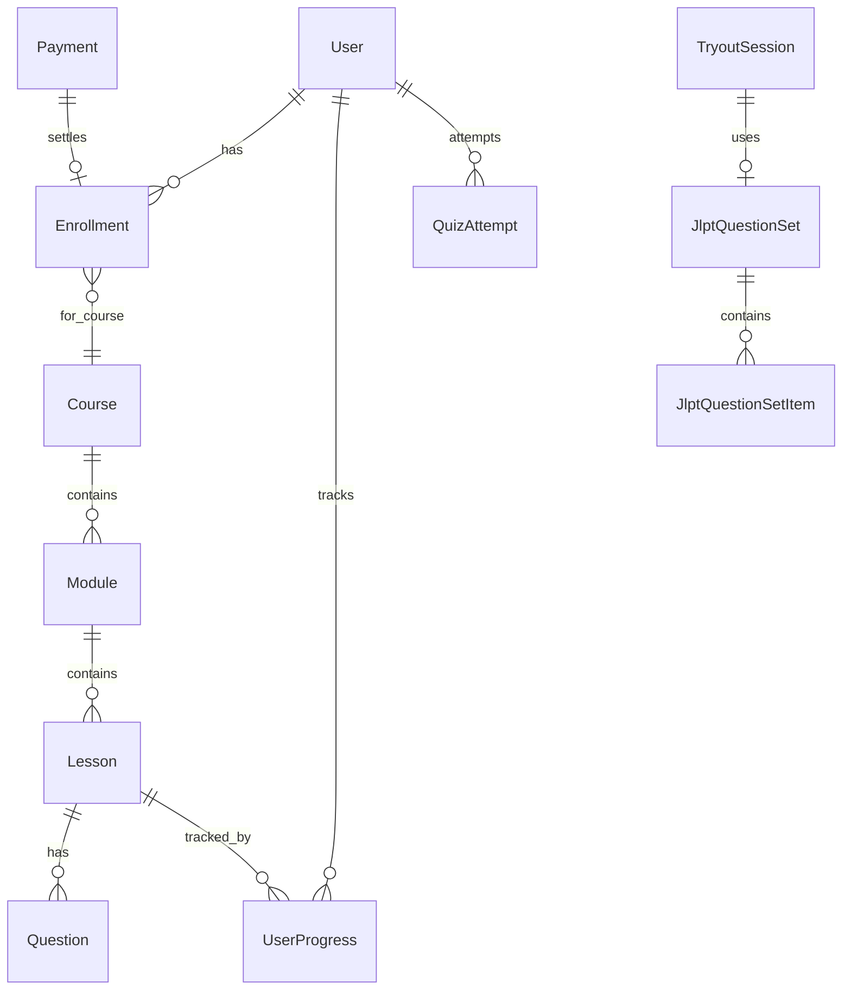

# 06 — Database & Model Data

Ringkasan strategi database LMS dan model Prisma utama. Detail: [DATABASE.md](../DATABASE.md), schema: [`prisma/schema.prisma`](../../prisma/schema.prisma).

---

## Strategi database

| Lingkungan | Pilihan | Status |
| :--- | :--- | :--- |
| **Development** | PostgreSQL lokal (`localhost`) | ✅ Aktif |
| **Production** | Belum ditentukan (Neon, Supabase, VPS, dll.) | ⏸️ Ditunda |

### Prinsip portabilitas

- Semua query lewat `prisma` dari `@/lib/prisma`
- Ganti host = ubah `DATABASE_URL` + `bun run db:migrate:deploy`
- Jangan hardcode connection string di kode
- Jangan simpan profil/XP user di DB LMS

### Koneksi Prisma

File tunggal: [`lib/prisma.ts`](../../lib/prisma.ts)

- `PrismaClient` + `PrismaPg` adapter + `pg.Pool`
- Singleton via `globalThis` di dev (hindari connection exhaustion hot-reload)
- Pool max: `PG_POOL_MAX` (default 10)

---

## Pola User jangkar

```prisma
/// FK anchor — id = Clerk User ID / Core User ID (String). Bukan sumber profil.
model User {
  id        String   @id
  createdAt DateTime @default(now())

  enrollments Enrollment[]
  progress    UserProgress[]
  attempts    QuizAttempt[]
  // ... relasi lain
}
```

| Aturan | Penjelasan |
| :--- | :--- |
| `id` tidak auto-generate | Nilai dari Clerk/Core saat user pertama kali tercatat |
| Tidak ada `email`, `name` | Profil dari JWT claims / Clerk |
| Upsert jangkar | `lib/auth/sync-user-anchor.ts` — dipanggil saat token exchange & aktivitas belajar |

---

## Kelompok model (overview)

### Pembelajaran

| Model | Fungsi |
| :--- | :--- |
| `Course` | Kursus (slug, level JLPT, harga, cover, outcomes) |
| `Module` | Modul dalam kursus |
| `Lesson` | Pelajaran (`lessonType`: VIDEO/FLASHCARD/QUIZ/TEXT) |
| `UserProgress` | Progress per lesson per user |
| `MaterialKanji` | Materi kanji per lesson |
| `MaterialKosakata` | Materi kosakata |
| `MaterialTataBahasa` | Materi tata bahasa |
| `Category` | Kategori kursus |

### Assessment & kuis

| Model | Fungsi |
| :--- | :--- |
| `Question` | Soal kuis per lesson |
| `QuestionOption` | Opsi jawaban kuis lesson |
| `QuizAttempt` | Attempt kuis lesson (skor, `answersJson`) |
| `JlptQuestion` | Soal bank JLPT (tryout) |
| `JlptQuestionOption` | Opsi soal JLPT |
| `JlptQuestionSet` | Paket soal (per level/sesi) |
| `JlptQuestionSetItem` | Item dalam paket |
| `ListeningStimulus` | Stimulus audio Choukai |
| `TryoutSession` | Sesi tryout (kode, level, harga, `questionSetId`) |
| `TryoutSessionItem` | Legacy composition (dual-read) |
| `TryoutExamProgress` | Progress ujian in-progress (session-scoped) |
| `PlacementAttempt` | Hasil tes penempatan |
| `PlacementExamProgress` | Progress tes penempatan in-progress |

### Enrollment & pembayaran

| Model | Fungsi |
| :--- | :--- |
| `Enrollment` | Polymorphic: COURSE / LIVE_CLASS / TRYOUT; status PENDING/ACTIVE/REJECTED |
| `EnrollmentLog` | Audit trail: REQUESTED/APPROVED/REJECTED/GRANTED/REVOKED |
| `Payment` | Ledger Midtrans (1:1 dengan enrollment berbayar) |
| `PaymentMethodSetting` | Toggle metode pembayaran (mode Core) |

### Gamifikasi (LMS-local)

| Model | Fungsi |
| :--- | :--- |
| `LmsBadge` | Katalog badge LMS (unlock rules, rarity, R2 image) |
| `UserBadge` | Badge yang dimiliki user |
| `LmsXpEvent` | Event XP lokal + **outbox sync Core** (`coreStatus`, `coreIdempotencyKey`) |
| `LmsPointEvent` | Poin LMS (leaderboard platform) |
| `UserLmsStats` | Agregat stat LMS per user |
| `LmsNotification` | Notifikasi in-app |

### Program lain

| Model | Fungsi |
| :--- | :--- |
| `LiveClass` | Kelas live (jadwal, harga, cover, Zoom URL) |
| `LiveClassSession` | Sesi dalam live class (rekaman, status) |

### Sosial (Q&A lesson)

| Model | Fungsi |
| :--- | :--- |
| `LessonComment` | Komentar di lesson |
| `LessonCommentReply` | Balasan nested + @mention |

---

## Diagram relasi (sederhana)



---

## Seed & migrasi

### Seed

```bash
bun run db:seed
```

Isi seed (indikatif):

- Kursus N5 + materi dari XLSX
- Tryout N5 Fase 1
- Live class contoh
- 8 badge starter (`public/badges/*.png`)
- Course gratis + berbayar, live class gratis + berbayar, tryout gratis + berbayar (uji monetisasi)

File: [`prisma/seed.ts`](../../prisma/seed.ts)

### Migrasi

| Perintah | Kapan |
| :--- | :--- |
| `bun run db:push` | Dev cepat — sync schema tanpa file migrasi |
| `bun run db:migrate` | Dev — buat migrasi resmi |
| `bun run db:migrate:deploy` | Production — apply migrasi |
| `bun run db:reset` | Dev — reset total + seed ulang |

### Script maintenance

| Script | Fungsi |
| :--- | :--- |
| `bun run lesson:backfill-types` | Backfill `Lesson.lessonType` dari konten legacy |
| `bun run course-import:backfill-external-ids` | Backfill external ID impor kursus |

---

## Yang TIDAK ada di DB LMS

| Data | Sumber |
| :--- | :--- |
| Profil user (email, nama, avatar) | Core JWT / Clerk |
| XP global, level, badge Core | Core API |
| Artikel berita | Portal Berita DB |
| Clerk webhook config utama | Core Service |

Schema Core canonical: [jepangku-core/docs/](../../jepangku-core/docs/) — **jangan edit salinan lokal di LMS**.
